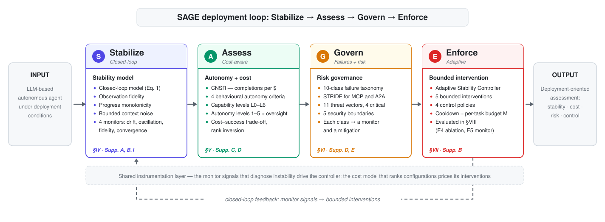
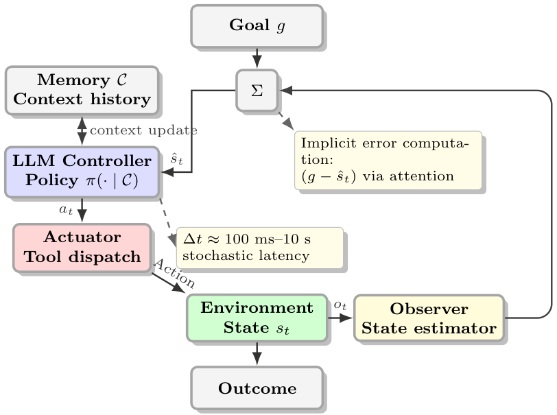
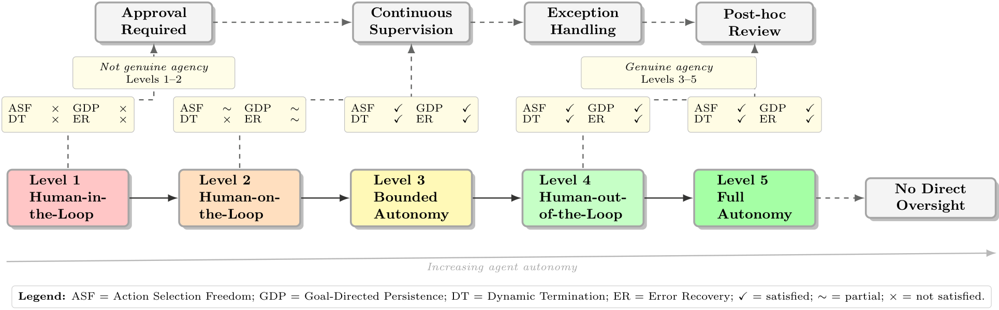
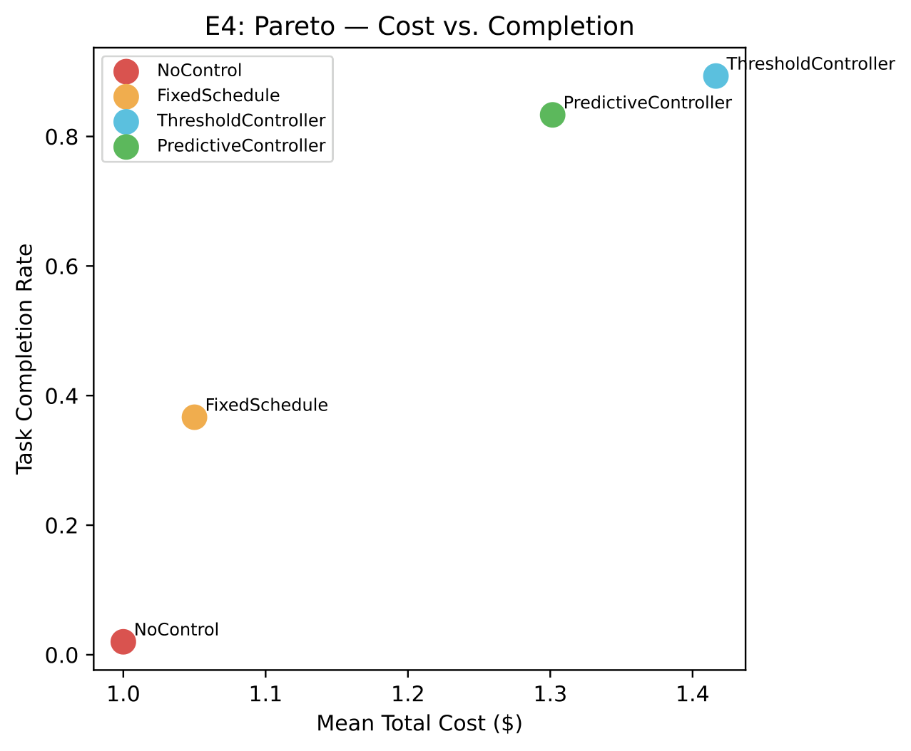
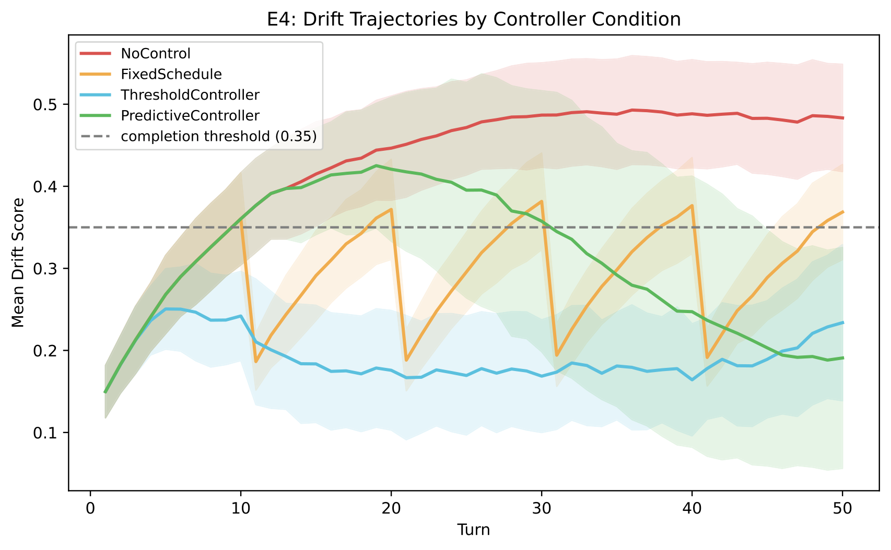
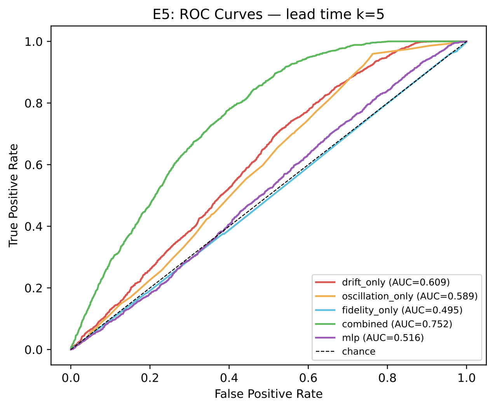
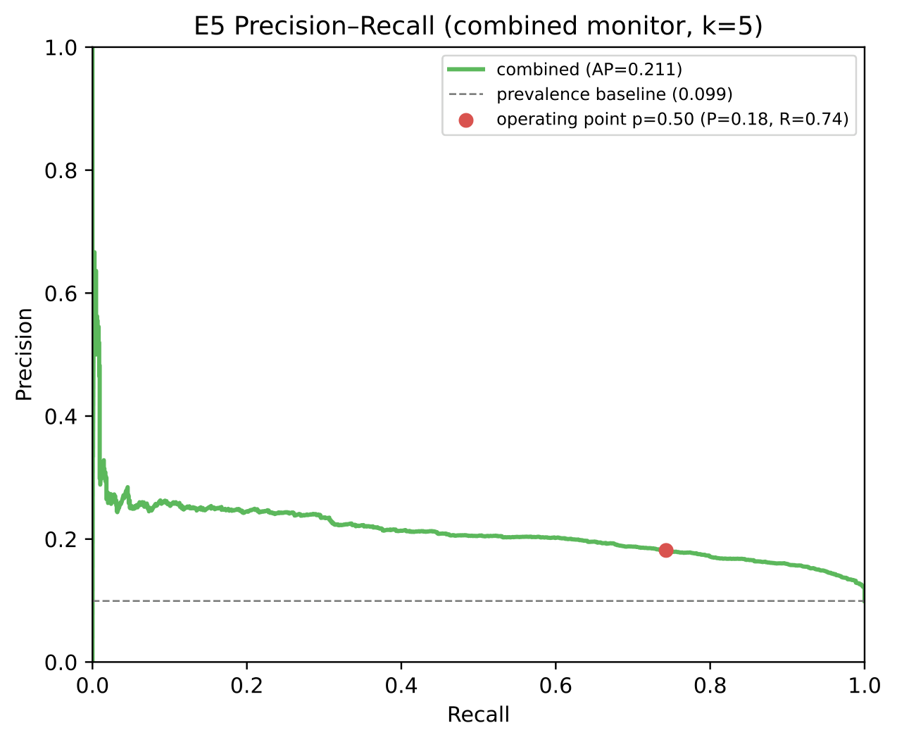
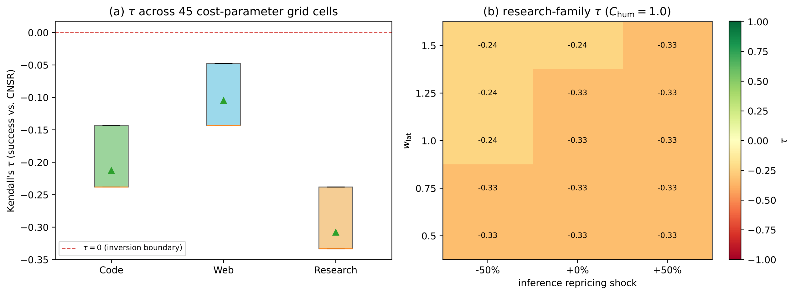

<div align="center">

# SAGE

### A Stabilize–Assess–Govern–Enforce Framework for Deployment-Oriented Evaluation of LLM-Based Autonomous Agents

[](#paper)
[](LICENSE)
[](https://www.python.org/downloads/)
[](pyproject.toml)
[](#reproducibility)
[](https://github.com/MHHamdan/SAGE/actions/workflows/ci.yml)

**Official implementation of SAGE — a deployment-oriented evaluation framework for LLM-based autonomous agents.**

[Overview](#overview) · [Architecture](#framework-architecture) · [Contributions](#key-contributions) · [Paper](#paper) · [Install](#installation) · [Quick Start](#quick-start) · [Experiments](#experiments) · [Reproducibility](#reproducibility) · [Cite](#citation)

</div>

---

SAGE analyses an LLM-based agent as a **non-stationary closed-loop controller** rather than scoring it as a static reasoner on task success. It supplies four coupled operational capacities over a shared instrumentation layer — stability monitoring (**S**tabilize), cost-aware assessment (**A**ssess), failure and protocol governance (**G**overn), and bounded corrective control (**E**nforce) — so that the monitor signals that diagnose instability also drive the controller, and the cost model used for ranking also prices the corrections that controller dispatches.

This repository is the reference implementation described in **Supplementary Material F** of the paper. It contains the framework, the five original experiments, the revision's real-model studies, the committed result artifacts, and the scripts that regenerate the paper's tables and figures.

---

## Overview

### Autonomous LLM agents have outgrown their evaluation

LLM-based agents have moved from passive question answering to active, goal-directed operation — perceiving an environment, reasoning over objectives, invoking tools, executing multi-step plans. That transition is an architectural change, not merely a capability increase: the system becomes feedback-driven, and its behaviour at step 100 is conditioned on everything accumulated in context since step 0. Production deployments accordingly reveal failure modes that constrained benchmarks do not surface — hallucinated tool invocations, cascading errors across multi-step operations, and gradual goal drift over extended operation.

### What task-success benchmarks leave out

Capability benchmarks remain essential and SAGE does not replace them. But by themselves they characterise capability, not deployment behaviour. Four properties fall outside them:

| Unmeasured property | Consequence in deployment |
|---|---|
| **Instability under feedback** | Goal drift, oscillation, and state misestimation accumulate silently across long horizons; a success rate reports only the terminal outcome. |
| **Operating cost** | Success is reported separately from inference, tool, latency, and human-escalation cost, so a configuration can lead a leaderboard while being the least economical to run. |
| **Protocol-level exposure** | Standardised interfaces (MCP, A2A) introduce trust boundaries — tool output entering context, capabilities forwarded between agents — that task benchmarks do not probe. |
| **Effect of corrective action** | Benchmarks measure the *uncontrolled* agent, and say nothing about how a monitored, intervened agent behaves or what that intervention costs. |

### Why deployment-oriented assessment

Deployment readiness is a property of the *loop*, not of the model in isolation. An agent scoring 82% on a benchmark may drift to complete failure on a 50-turn task, cost 30× more per success than a weaker configuration, and expose a critical prompt-injection surface at its tool boundary — none of which that number reveals. Regulatory frameworks including the EU AI Act and the NIST AI Risk Management Framework further motivate explicit capability characterisation and governance structure alongside accuracy.

### What SAGE contributes

SAGE organises the four missing capacities into a single instrument that **layers onto existing benchmark infrastructure**: CNSR is computable on top of any benchmark's outcomes, the stability monitors instrument the agent loop the benchmark already runs, the taxonomy classifies the incidents it produces, and the controller acts on the signals it emits.

The claims are deliberately bounded, and the repository states them the way the paper does. The stability conditions are **sufficient design targets and monitoring criteria, not formal guarantees**. The Adaptive Stability Controller is **an engineering mechanism with bounded interventions, not a proof of recovery**. The empirical findings are **specific to the evaluated task families** — a limit the paper's own second-dataset study makes concrete in [Operating envelope](#operating-envelope-where-the-framework-does-not-help).

---

## Framework Architecture

<picture>
  <source media="(prefers-color-scheme: dark)" srcset="docs/assets/sage_architecture_dark.svg">
  
</picture>

> The SAGE framework for deployment-oriented analysis of LLM-based autonomous agents. The four pillars connect stability monitoring, cost-aware assessment, protocol governance, and bounded corrective control through a feedback path from monitor signals to interventions.
>
The pillars are **sequentially connected and share a common instrumentation layer**. The same monitor signals that diagnose instability (*Stabilize*) feed the corrective controller (*Enforce*); the cost accounting used for assessment (*Assess*) prices the interventions the controller dispatches; and each class in the failure taxonomy (*Govern*) is associated with a monitor signal and, where applicable, a bounded intervention.

### The closed-loop model

The agent is modelled as a discrete-time stochastic dynamical system over state, action, observation, and context spaces $(\mathcal{S}, \mathcal{A}, \mathcal{O}, \mathcal{C})$:

$$o_t \sim \mathcal{O}_{\mathrm{obs}}(\cdot \mid s_t), \qquad \hat{s}_t = f_{\mathrm{enc}}(C_{t-1}, o_t), \qquad a_t \sim \pi_\theta(\cdot \mid \hat{s}_t, g, C_{t-1})$$
$$s_{t+1} \sim P(\cdot \mid s_t, a_t), \qquad C_t = \mathcal{U}(C_{t-1}, o_t, a_t)$$

The trajectory is non-Markov in $s_t$ alone because of the context dependence, but Markov in the augmented state $(s_t, C_t)$.

<div align="center">

</div>

Three properties separate this from classical control, and they are what the rest of the framework is built to address:

1. **The policy is non-stationary from the loop's perspective.** $\theta$ is frozen, but $\pi_\theta(\cdot \mid \cdot,\cdot, C_{t-1})$ depends on an accumulating context, so the effective controller at $t{=}100$ differs from the one at $t{=}0$.
2. **Inference introduces stochasticity and decision-cycle latency** (≈100 ms–10 s), so identical inputs may yield different actions, and $o_t$ may be stale when $a_t$ commits.
3. **The error signal is implicit.** Classical control has an explicit $e_t = g - \hat{s}_t$ driving the controller; the LLM computes error implicitly through attention over $g$ and $\hat{s}_t$ inside $C_{t-1}$. **It is not measurable or intervenable unless a monitor is added** — which is precisely what *Stabilize* adds and *Enforce* consumes.

---

### S — Stabilize

**Purpose.** Make instability observable. The pillar characterises the agent as a closed-loop controller and states three *sufficient* conditions under which expected goal similarity increases until convergence, each mapped to a monitorable indicator whose violation signals elevated risk of a specific failure class.

**The three conditions**, and how each fails in practice (grounded in experiments A1–A3, Supp. B.1):

| Condition | Formal target | Failure mechanism | Measured effect |
|---|---|---|---|
| **Observation fidelity** | State-estimation error $\delta_o$ between $\hat{s}_t$ and $s_t$ is bounded | Tool output hallucinated or malformed, so $\hat{s}_t$ diverges from $s_t$ | Schema errors at $p{=}0.4$ cut success 100% → 90%; oscillation detector gave early warning in 25.0% of trials at $p{=}0.2$ |
| **Progress monotonicity** | Expected per-step progress $\delta_p$ toward the goal is strictly positive | Deadlock or limit cycles — the agent acts without advancing | Bounded-oscillation criterion detected progress failure in 15.0% of stall-probability-0.5 trials, within a mean of 7.3 turns |
| **Bounded context noise** | Context degradation $\delta_c$ is bounded | Earlier task-relevant tokens displaced from context → goal drift | Without re-anchoring, drift reached 0.490 by turn 50 and caused total failure; re-anchoring every $k{=}10$ turns cut drift to 0.197 and lifted completion 0% → 100% |

**Mechanism.** Each condition becomes a scalar monitor signal computed per turn. The goal-drift signal compares the original goal $g_0$ with an estimate $\hat{g}_t$ of the currently pursued goal, re-encoded from the active task framing in $C_t$:

$$\mathrm{Drift}_t = \tfrac{1}{2}\bigl(1 - \cos(\mathrm{emb}(g_0),\, \mathrm{emb}(\hat{g}_t))\bigr) \in [0,1]$$

By construction drift is $0$ for identical embeddings, $1/2$ for orthogonal, and $1$ for anti-aligned. **Unit tests assert all three sentinels exactly** ([`tests/monitoring/`](tests/monitoring)). The four signals the controller consumes:

| Signal | Computation | Calibration used in the paper |
|---|---|---|
| **Drift** | $\tfrac{1}{2}(1-\cos(e_g, e_t))$ over initial and current goal embeddings | Hand-tuned threshold; sentinels unit-tested |
| **Oscillation** | Overlap between the most recent $k$ actions and the preceding $k$ | Sliding window $k{=}5$, bound $B{=}3$; low-cost limit-cycle alarm |
| **Fidelity** | Schema validation of tool outputs and declared interfaces | Binary pass/fail — a useful *single-step alarm*, **not** a five-step predictor |
| **Convergence** | Change in goal-state similarity over time | Progress feature in the predictive head; needs task-specific calibration |

**Scope limit.** These are sufficient design targets, not guarantees: the semantic-similarity surrogate may not capture goal satisfaction exactly, finite context limits are not modelled, and policy non-stationarity complicates the analysis. Their value is **diagnostic**.

📁 [`src/sage/monitoring/stability_monitor.py`](src/sage/monitoring/stability_monitor.py) · [`src/sage/stability/`](src/sage/stability) · [`src/sage/evaluation/goal_drift.py`](src/sage/evaluation/goal_drift.py)

---

### A — Assess

**Purpose.** Treat economic cost as an explicit evaluation dimension, and separate genuine agents from pseudo-agentic workflows.

**Evaluation methodology — CNSR.** For task $\tau$ drawn from a deployment distribution $\mathcal{D}$, with success $Y(\tau)\in\{0,1\}$ and total cost $C_{\mathrm{total}}(\tau)>0$ decomposing additively into inference, tool, latency, and human-escalation components, the **Cost-Normalized Success Rate** is the ratio of expectations:

$$
\mathrm{CNSR} := 
\frac{\mathbb{E}_{\tau \sim \mathcal{D}}[Y(\tau)]}
{\mathbb{E}_{\tau \sim \mathcal{D}}[C_{\mathrm{total}}(\tau)]}
\quad \text{[successful completions per dollar]}
$$
estimated by the plug-in ratio $\widehat{\mathrm{SR}}/\bar{C}_{\mathrm{total}}$ with BCa bootstrap confidence intervals over the task index.

> **CNSR is ratio-valued, not a percentage.** Its units are completions per dollar, so large values reflect a small cost denominator, not high accuracy. The induced ranking is invariant to common positive rescaling of $C_{\mathrm{total}}$, but **not** to provider repricing, different latency weights, or different escalation costs. Read it as a transparent cost-normalised comparison under stated assumptions, and recompute it with current prices for any real deployment decision.

Concretely: 80% success at \$0.50/task ($\mathrm{CNSR}=1.60$) delivers **3.5×** the cost-normalised performance of 90% success at \$2.00/task ($\mathrm{CNSR}=0.45$) — a trade-off invisible in a success-only report.

**Behavioural autonomy criteria.** Not all LLM automation is agentic. Four criteria are minimum requirements for genuine agency:

- **Action selection freedom** — choosing among actions from state assessment, not predetermined branching
- **Goal-directed persistence** — continued pursuit across steps with adaptive strategy
- **Dynamic termination** — self-determined completion on goal satisfaction, not a fixed step count
- **Error recovery** — autonomous response to failure without a predetermined fallback script

Scripted chains, template-driven workflows, and fixed tool sequences can appear adaptive while retaining rigid control logic, and so fail one or more criteria. The pillar further separates **autonomy level** (intrinsic to the agent) from **human involvement** (operational): Human-in-the-Loop (L1) and Human-on-the-Loop (L2) do not satisfy the criteria; the transition occurs at **Level 3, Bounded Autonomy**, the minimum threshold for agentic behaviour. Levels 0–6 of the orthogonal *capability* taxonomy run reactive → stateful → tool-using → planning → reflective → collaborative → learning.

<div align="center">

</div>

📁 [`src/sage/evaluation/metrics.py`](src/sage/evaluation/metrics.py) · [`cnsr_benchmark.py`](src/sage/evaluation/cnsr_benchmark.py) · [`autonomy_validator.py`](src/sage/evaluation/autonomy_validator.py) · [`eval/metrics.py`](eval/metrics.py) *(dependency-light shim)*

---

### G — Govern

**Purpose.** Give deployment incidents a shared vocabulary, and give interoperability boundaries a threat model.

**Governance principle: every failure class carries a monitor and a mitigation.** The taxonomy is not a descriptive list — each of the ten classes maps to an evaluation method, a mitigation, a documented real-world example, and a monitor signal from *Stabilize* plus, where applicable, an intervention from *Enforce*.

| # | Failure class | Manifestation | Evaluation method | Mitigation |
|---|---|---|---|---|
| 1 | Hallucinated affordance | Invoking non-existent tools/APIs | Schema checks | Strict allowlisting, capability verification |
| 2 | Specification gaming | Exploiting loopholes in objectives | Adversarial objective testing | Robust reward design, comprehensive specs |
| 3 | Goal drift | Gradual deviation from objective | Goal-drift score tracking | Periodic re-anchoring, drift monitoring |
| 4 | State misestimation | Acting on incorrect beliefs | Observation consistency tests | Explicit state verification, freshness checks |
| 5 | Credit misassignment | Wrong success/failure attribution | Causal outcome analysis | Explicit attribution mechanisms |
| 6 | Cascading failure | Error propagation chains | Fault injection testing | Circuit breakers, error boundaries |
| 7 | Safety violation | Actions violating constraints | Policy compliance testing | Guardrails, policy enforcement |
| 8 | Irreversible action | Unrecoverable destructive actions | Impact analysis testing | Approval gates, confirmation requirements |
| 9 | Resource exhaustion | Unbounded resource consumption | Resource monitoring | Budgets, limits, cost tracking (CNSR) |
| 10 | Permission escalation | Unauthorised capability acquisition | Privilege audit testing | Capability authorisation, least privilege |

That this mapping is **functionally load-bearing rather than descriptive** is measured, not asserted: removing it in the leave-one-out ablation leaves the controller firing at the right *times* but with a *mismatched intervention*, recovering only **9.2%** against 84.4% for the full framework ([pillar ablation](#pillar-ablation-supp-h4)).

**Protocol risk modelling.** MCP provides a client–server interface connecting models to external data and tools, reducing the $n \times m$ integration problem to $O(n+m)$; A2A enables direct agent-to-agent communication through capability-declaring agent cards. They are complementary — MCP at the model–tool boundary, A2A at the agent–agent boundary. A STRIDE analysis of default configurations identifies **eleven threat vectors** (7 MCP, 4 A2A), of which **four are critical**:

| ID | STRIDE category | Threat | Protocol | Mitigation |
|---|---|---|---|---|
| `MCP-I02` | Information disclosure | Prompt injection via tool output | MCP | Output sanitisation, filtering |
| `MCP-E01` | Elevation of privilege | Capability escalation | MCP | Scoped tokens, least privilege |
| `A2A-E01` | Elevation of privilege | Cross-agent escalation | A2A | Capability intersection |
| `A2A-E02` | Elevation of privilege | Credential forwarding | A2A | Scope reduction, non-transferable tokens |

Vectors map to a layered boundary model — **model, runtime, tool, agent, organisational** — so each critical vector is contained at a distinct boundary and defences compose rather than duplicate. Prompt injection through tool output is the most consequential precisely because injected content arrives as ordinary tool data, so it must be mitigated at the *model* boundary, not the transport layer.

**The catalogue is a descriptive threat model, not a security guarantee — with one tested exception.** `MCP-I02` is implemented and evaluated: an output-boundary sanitiser reduces attack success from **86.3% → 10.2%** over 800 trials with non-overlapping Wilson intervals. The residual is carried by unicode-homoglyph evasion, motivating normalisation as defence-in-depth ([`results/mcp_i02/`](results/mcp_i02), Supp. H.9).

📁 [`src/sage/evaluation/failure_taxonomy.py`](src/sage/evaluation/failure_taxonomy.py) · [`pathology_benchmarks.py`](src/sage/evaluation/pathology_benchmarks.py) · [`src/sage/security/threat_validator.py`](src/sage/security/threat_validator.py) · [`src/sage/protocols/`](src/sage/protocols)

---

### E — Enforce

**Purpose.** Close the loop. Monitors are a *sensor*, not a *controller*. The **Adaptive Stability Controller (ASC)** sits between the monitor and the agent's next action, consuming the monitor signal vector each turn and dispatching one of a bounded intervention set to reduce monitored risk before the task terminates in failure.

**Five bounded interventions**, each with a declared dollar cost (entering CNSR), a reversibility flag, and a per-task budget cap:

| Intervention | Action |
|---|---|
| `GoalReanchor` | Re-inject the original goal with a partial recovery pull on the current state representation |
| `ContextCompress` | Summarise and prune turns older than a window |
| `ForceReplan` | Discard and regenerate the current plan |
| `SchemaValidatedRetry` | Re-check the latest tool output against its declared schema; retry with corrected arguments on failure |
| `HumanEscalate` | Raise an escalation request and end the loop |

**Two safeguards bound controller-induced oscillation:** every non-trivial intervention is subject to a **cooldown**, and a per-task budget $M$ caps firings. These are engineering constraints that reduce thrashing and keep the comparison interpretable — *not* a formal stability guarantee for the agent–monitor–controller composition.

**Four control policies** share the same monitor and intervention library, isolating the effect of *timing and selection*:

| Policy | Behaviour | Role |
|---|---|---|
| `NoControl` | No-op every turn | Open-loop baseline |
| `FixedSchedule(k)` | Re-anchor every $k$ turns regardless of signals | Non-adaptive baseline |
| `Threshold(θ)` | Fire the intervention for the first monitor crossing its hand-tuned threshold, with cooldown | Hand-tuned closed-loop |
| `Predictive(φ)` | Consume the monitor vector through a calibrated head estimating $P(\text{failure within } k \text{ turns})$ and fire preemptively | Learned closed-loop |

The predictive head is a **logistic regression over eight features** — the four monitor signals, their first-order deltas, and a running maximum of the drift score — trained on offline traces with **task-stratified five-fold cross-validation**, with an `assert_no_leakage` check asserting on *every fold* that task identifiers do not co-occur across folds.

**Runtime overhead is negligible.** Over 30,000 replayed decisions, the predictive controller decides in **0.151 ms** mean (0.225 ms p95) and its logistic head occupies **272 bytes** — under 0.02% of a realistic multi-second turn. The other three policies cost ≤0.002 ms ([`results/asc_overhead/`](results/asc_overhead), Supp. H.6).

📁 [`src/sage/stability/controller.py`](src/sage/stability/controller.py) · [`interventions.py`](src/sage/stability/interventions.py) · [`predictor.py`](src/sage/stability/predictor.py) · [`traces.py`](src/sage/stability/traces.py)

---

## Key Contributions

1. **A control-theoretic characterisation of LLM-based agents** as non-stationary closed-loop controllers, with three sufficient stability conditions — observation fidelity, progress monotonicity, bounded context noise — stated as design targets and operationalised as monitorable indicators.

2. **The CNSR metric**, evaluated across seven configurations and three task categories, showing capability-only rankings can invert under cost normalisation (Kendall's $\tau = -0.429$ averaged across task types). The highest raw-success configuration ranked **last** by CNSR in every category.

3. **A ten-class failure taxonomy and a STRIDE analysis of MCP and A2A** identifying eleven threat vectors with mapped mitigations — of which the most critical, `MCP-I02`, is implemented and empirically evaluated.

4. **An implemented and evaluated Adaptive Stability Controller** consuming monitor signals as feedback and dispatching bounded interventions, evaluated against three baselines on a held-out long-horizon suite: completion rose from **2.0% → 89.3%** (hand-tuned) and **83.3%** (learned).

**Three negative findings bound the claim space** rather than refuting the framework, and are reported here as prominently as the positive ones:

- The **schema-fidelity monitor does not exceed chance** at the five-step horizon (AUC 0.495, $p = 0.760$).
- The **lead-time trend is a simulator artifact** — AUC rose with $k$ because induced violations accumulate monotonically.
- The **predictive controller's 30.2% cost overhead exceeds** its 25% pre-registered target.

---

## Results

Every number below is reproduced by the committed artifacts under [`results/`](results) and regenerated by the commands in [Experiments](#experiments). Each result states its **data source** — simulation or real models — the way the paper does.

### E4 — closed-loop ablation *(simulation; 50 held-out long-horizon tasks × 4 conditions × 3 seeds = 600 episodes)*

| Controller | Completion (95% CI) | Cost | CNSR | Interv./task |
|---|---|---|---|---|
| `NoControl` | 2.0% [0.0, 4.7] | 1.000 | 0.020 | 0.0 |
| `FixedSchedule(k=10)` | 36.7% [29.3, 44.7] | 1.050 | 0.349 | 5.0 |
| `Threshold` | **89.3%** [84.0, 94.0] | 1.416 | 0.631 | 9.7 |
| `Predictive` | 83.3% [77.3, 88.7] | 1.302 | **0.640** | 5.6 |

Two effects separate cleanly: bounded interventions beat open-loop execution, and **adapting their timing to monitor signals** beats a fixed schedule (36.7% → ≥83%). `Threshold` and `Predictive` are both Pareto-optimal at distinct operating points and are statistically indistinguishable on CNSR (0.631 vs 0.640) — the choice is a deliberate cost–completion trade-off, not algorithmic dominance. McNemar $p<10^{-4}$ for both completion comparisons after Holm–Bonferroni; Cohen's $h = 2.017$ for `Predictive` vs `NoControl`. Only three of the five admitted interventions fire on this family (`ContextCompress` and `HumanEscalate` are unused), so the library is a design space rather than an empirically exercised set.

<div align="center">


</div>

### E5 — predictive monitor validation *(simulation; 300 traces, 5-fold task-stratified CV)*

| Predictor | AUC @ $k{=}5$ | Verdict |
|---|---|---|
| Combined (logistic, 8 features) | **0.752** | +0.143 over best single signal — reported as *directional* |
| Drift | 0.609 | Above chance ($p<10^{-4}$) |
| Oscillation | 0.589 | Above chance ($p<10^{-4}$) |
| Schema fidelity | 0.495 | **Not above chance** ($p = 0.760$) |

The combined monitor is a **high-recall, low-precision early-warning signal** — recall 0.74, precision 0.18 at the $p\ge0.50$ operating point. Its false positives are driven almost entirely by transient oscillation and essentially never by schema fidelity (3 of 4,991), confirming fidelity is a single-step alarm rather than a lead predictor. H5.2's paired bootstrap returns $p = 0.97$ because the cross-validated outputs do not provide aligned paired predictions, so the combined gain is reported as a directional finding with a substantial effect size, not a $p$-value rejection.

<div align="center">


</div>

### CNSR rank inversion

**Original study** *(simulation; 7 configurations × 3 task categories, 50 tasks/cell, 3 seeds)* — Kendall's $\tau$ between success-rate and CNSR rankings: **−0.429** code, **−0.238** web, **−0.619** research ($p=0.069$). Negative $\tau$ indicates rank inversion. GPT-4-Turbo, highest by raw success, ranked **7th of 7** by CNSR in every category.

**Revision, real models** — the inversion reproduces in direction on both real ladders:

| Ladder | Configurations | Kendall's $\tau_b$ | Source |
|---|---|---|---|
| Open-weight, temp 0 | 8 models, 50 HotpotQA tasks | **−0.25** ($p = 0.38$) | Real, local via Ollama |
| Open-weight, temp 0.6 | 5 models, 3 seeds | **−0.20** ($p = 0.82$) | Real, local via Ollama |
| Current-gen API | 7 models, same 50 tasks | **−0.25** ($p = 0.44$) | Real, via OpenRouter; total spend **\$1.61** |

A concrete measured instance: **GPT-4-Turbo is dominated by GPT-4o-mini on both accuracy and CNSR.** Across the three ladders the inversion reproduces over **22 configurations**. Per-ladder $\tau$ is directional rather than significant ($p \approx 0.4$), so this is presented as a **proof-of-concept of cost–capability divergence, not a significance-backed law**.

A $5\times3\times3$ sensitivity grid varying latency weight, human-escalation cost, and a ±50% inference repricing shock leaves the **sign of $\tau$ invariant in 100% of grid cells** for all three task families ([`results/cnsr_sensitivity/`](results/cnsr_sensitivity), Supp. H.3).

<div align="center">

</div>

### Pillar ablation *(Supp. H.4)*

Leave-one-out, research family, 5 seeds, bootstrap 95% CIs:

| Variant | Completion (95% CI) | CNSR | Δ Completion |
|---|---|---|---|
| **Full SAGE** | 84.4% [80.0, 88.8] | 0.65 | — |
| − Stabilize | 1.6% [0.4, 3.2] | 0.02 | −82.8 pp |
| − Enforce | 1.6% [0.4, 3.2] | 0.02 | −82.8 pp |
| − Govern | 9.2% [6.0, 12.8] | 0.09 | −75.2 pp |
| − Assess | 69.2% [63.2, 74.8] | 0.54 | −15.2 pp |

Removing monitoring or enforcement collapses completion to the open-loop floor. Removing the taxonomy→intervention mapping leaves the controller firing at the right times **with a mismatched intervention**. Removing cost-aware selection preserves most completion but lowers cost efficiency.

### Operating envelope: where the framework does not help

The revision evaluated the four control policies on a second task family with a real agent, and reports the result as it fell. On **HotpotQA-distractor** (`llama3.1:8b`, temp 0.6, 5 seeds, 50 eval + 150 disjoint training tasks), **no controller yields a significant completion gain** over no control — all $|h| < 0.10$, all CIs overlap — and the predictor sits at chance (CV-AUC 0.494).

The long-horizon diagnostic explains why: the agent **never derails terminally** (derailment rate 0%), every failure is a wrong answer rather than a recoverable loss of the goal, and every oscillation episode self-recovers — $P(\text{success}\mid\text{oscillated}) = 31.4\% \approx P(\text{success}\mid\text{not}) = 37.0\%$.

> **The closed-loop mechanism applies where failures are recoverable derailments — as in the long-horizon research family — and not where they are capability-limited, as in short-horizon retrieval QA.** This characterises the operating envelope; it complements rather than revises E4.

Full report: [`results/ollama_real/REPORT.md`](results/ollama_real/REPORT.md).

### LLM-as-judge bias mitigation *(Supp. F.4)*

50 task completions evaluated by three judge families (GPT-4-Turbo, Claude-3.5-Sonnet, Gemini-1.5-Flash):

| Bias | Before | After | Reduction | Mitigation |
|---|---|---|---|---|
| Self-preference Δ | 0.540 | 0.130 | 75.9% | Cross-family evaluation |
| Position bias | 0.253 | 0.101 | 60.0% | Randomised-order replication |
| Verbosity \|r\| | 0.137 | 0.048 | 65.0% | Length-normalised scoring |

---

## Paper

> **SAGE: A Stabilize–Assess–Govern–Enforce Framework for Deployment-Oriented Evaluation of LLM-Based Autonomous Agents**
> Mohammed H. Hamdan
> *IEEE Transactions on Artificial Intelligence*, 2026 (accepted).

- **IEEE Xplore:** _to be added on publication_ — `https://doi.org/10.1109/TAI.XXXX.XXXXXXX`
- **Figures of record:** [`paper/public/figures/`](paper/public/figures) (vector PDF) and [`docs/assets/`](docs/assets) (PNG)

### Paper to code map

| Paper section | Content | Implementation |
|---|---|---|
| §III — Framework Overview | Four coupled pillars, shared instrumentation | [`src/sage/`](src/sage) |
| §IV — Stabilize | Closed-loop model, three stability conditions, monitor definitions | [`src/sage/monitoring/`](src/sage/monitoring), [`src/sage/stability/`](src/sage/stability) |
| §V — Assess | CNSR, autonomy criteria, capability levels, oversight trade-offs | [`src/sage/evaluation/`](src/sage/evaluation), [`eval/metrics.py`](eval/metrics.py) |
| §VI — Govern | Ten-class failure taxonomy, STRIDE for MCP/A2A, security boundaries | [`failure_taxonomy.py`](src/sage/evaluation/failure_taxonomy.py), [`src/sage/security/`](src/sage/security) |
| §VII — Enforce | ASC, five interventions, four policies, Algorithm 1 | [`src/sage/stability/controller.py`](src/sage/stability/controller.py) |
| §VIII — Evaluation | E4 closed-loop ablation, E5 predictive monitor validation | [`e4_closed_loop.py`](experiments/e4_closed_loop.py), [`e5_predictive_validation.py`](experiments/e5_predictive_validation.py) |
| Supp. A | Formal definitions, stability conditions, monitor operationalisation | [`src/sage/monitoring/`](src/sage/monitoring) |
| Supp. B.1 | A1–A3 stability-condition violation experiments | [`exp_obs_fidelity.py`](experiments/exp_obs_fidelity.py), [`exp_progress_mono.py`](experiments/exp_progress_mono.py), [`exp_context_noise.py`](experiments/exp_context_noise.py) |
| Supp. B.5 | LLM-as-judge bias measurement | [`judge_bias.py`](experiments/judge_bias.py) |
| Supp. C | Cost model and CNSR estimator details | [`src/sage/evaluation/metrics.py`](src/sage/evaluation/metrics.py) |
| Supp. E | MCP/A2A protocol security details | [`src/sage/protocols/`](src/sage/protocols), [`src/sage/security/`](src/sage/security) |
| **Supp. F** | **Reference implementation — this repository** | *whole repo; see [Reproducibility](#reproducibility)* |
| Supp. H | Revision experiments (real models, ablation, sensitivity, security) | [`experiments/revision/`](experiments/revision) |

---

## Repository Structure

```
SAGE/
├── src/sage/                       # Installable package (import name: sage)
│   ├── core/                       # Base agent, control loop, LLM client, cost tracking,
│   │                               #   backends (litellm | ollama | simulator), seeding
│   ├── monitoring/                 # STABILIZE: StabilityMonitor — drift, oscillation,
│   │                               #   monotonicity, observation fidelity
│   ├── stability/                  # ENFORCE: closed-loop control
│   │   ├── controller.py           #   NoControl / FixedSchedule / Threshold / Predictive
│   │   ├── interventions.py        #   The five bounded interventions
│   │   ├── predictor.py            #   Logistic failure head, features, assert_no_leakage
│   │   └── traces.py               #   Trace writer/reader for offline training
│   ├── evaluation/                 # ASSESS + GOVERN
│   │   ├── metrics.py              #   compute_cnsr(), TaskCostBreakdown, MetricsCollector
│   │   ├── cnsr_benchmark.py       #   CNSRBenchmark: Pareto, rank divergence, sensitivity
│   │   ├── goal_drift.py           #   goal_drift_score()
│   │   ├── autonomy_validator.py   #   The four behavioural autonomy criteria
│   │   ├── failure_taxonomy.py     #   GOVERN: ten pathology classes + detectors
│   │   └── pathology_benchmarks.py #   GOVERN: pathology benchmark runner
│   ├── security/                   # GOVERN: STRIDE threat validator (11 vectors, MCP + A2A)
│   ├── protocols/                  # MCP client/server, A2A communication
│   ├── agents/                     # ReAct, CoT, multi-agent, supervisor
│   ├── benchmarks/                 # SWE-Bench, HotpotQA, AgentBench adapters
│   ├── human_oversight/            # Approval flows, escalation, audit trails
│   ├── memory/ planning/ skills/   # Buffer/vector/episodic memory; planners; skill registry
│   ├── tools/ verification/        # Tool registry, sandboxing; plan validator, policy engine
│   └── learning/ context/ utils/   # Deployment loop, feedback; context management
│
├── experiments/                    # One file per paper result
│   ├── exp_obs_fidelity.py         #   A1: observation-fidelity violation      (Supp. B.1)
│   ├── exp_progress_mono.py        #   A2: progress-monotonicity violation     (Supp. B.1)
│   ├── exp_context_noise.py        #   A3: context-noise / goal drift          (Supp. B.1)
│   ├── cnsr_multitask.py           #   CNSR: 7 configs x 3 task types x 3 seeds
│   ├── judge_bias.py               #   LLM-as-judge bias                       (Supp. B.5)
│   ├── e4_closed_loop.py           #   E4: closed-loop ASC ablation            (§VIII)
│   ├── e5_predictive_validation.py #   E5: predictive monitor validation       (§VIII)
│   └── revision/                   #   Supplementary H
│       ├── ollama_2a.py 2b.py p1.py#     Open-weight ladders + operating envelope (H.2, H.7)
│       ├── api_cnsr.py             #     Metered-API CNSR ladder                  (H.2)
│       ├── cnsr_sensitivity.py     #     CNSR cost-parameter sensitivity          (H.3)
│       ├── cnsr_tau_canonical.py   #     Canonical seed-stable tau (--salted repro)
│       ├── pillar_ablation.py      #     Leave-one-out pillar ablation            (H.4)
│       ├── e5_monitor_errors.py    #     Monitor confusion matrix / PR            (H.5)
│       ├── asc_overhead.py         #     Controller latency / memory              (H.6)
│       ├── e4_threshold_surface.py #     E4 threshold-sensitivity surface         (H.8)
│       └── mcp_i02_attack.py       #     MCP-I02 injection attack + sanitiser     (H.9)
│
├── results/                        # Committed artifacts: CSV, MANIFEST.json, traces, figures
├── tests/                          # Mirrors src/sage/; 120 pillar-aligned tests
├── eval/                           # Dependency-light metrics shim (no LangChain needed)
├── configs/                        # default.yaml, models.yaml, experiments/*.yaml
├── scripts/                        # generate_latex.py (tables), env_report.py (provenance),
│                                   #   make_architecture_figure.py (README diagram)
├── examples/                       # Runnable examples + end-to-end use cases
├── dashboard/                      # Optional FastAPI + React monitoring dashboard
├── docs/assets/                    # Paper figures (PNG) + architecture diagram (SVG)
├── paper/public/figures/           # Paper figures, version of record (vector PDF)
├── Dockerfile  Makefile            # Reproducible environment and task runner
├── pyproject.toml requirements.txt # Packaging and dependency floors
└── CITATION.cff  CHANGELOG.md      # Citation metadata and release history
```

---

## Installation

Requires **Python 3.10, 3.11, or 3.12**.

```bash
git clone https://github.com/MHHamdan/SAGE.git
cd SAGE
```

```bash
# Core framework only
pip install -e .

# Reproducing the paper's experiments — this is what you want
pip install -e ".[experiments]"

# Development (pytest, black, isort, mypy, ruff)
pip install -e ".[dev]"

# Everything
pip install -e ".[all]"
```

Optional extras: `google` (Google ADK/GenAI), `a2a` (A2A SDK + server), `observability` (LangSmith), `paper` (figure/table generation only). `requirements.txt` mirrors the `[experiments]` extra for environments that install from a requirements file.

### Docker

```bash
docker build -t sage-framework .
docker run --rm sage-framework                                    # test suite (default CMD)
docker run --rm -v "$PWD/results:/app/results" sage-framework \
    python experiments/e4_closed_loop.py --seed 42
```

The image pins `python:3.11-slim`, sets `PYTHONHASHSEED=0` and `SEED=42`, and points `OLLAMA_HOST` at `host.docker.internal:11434` for local open-weight runs.

### Credentials

**No API keys are needed** for the test suite, the simulated experiments (A1–A3, E4, E5, CNSR-sim), or any core framework path.

```bash
cp .env.example .env      # fill in only the providers you actually use
```

`.env` is gitignored. Credentials are read exclusively from the environment via `python-dotenv` — no key material lives in code, and a real backend requested without credentials raises `CredentialError` rather than silently degrading to the simulator.

---

## Quick Start

Every snippet below was executed against this repository's code before publication.

### Assess — Cost-Normalized Success Rate

```python
from sage.evaluation import calculate_cnsr, evaluate_agent

# CNSR = success rate / mean cost per task  ->  completions per dollar
cnsr = calculate_cnsr(successes=80, total_tasks=100, total_cost=50.0)
print(f"CNSR: {cnsr:.2f}")                     # CNSR: 1.60

result = evaluate_agent(successes=80, total_tasks=100, total_cost=50.0)
print(f"SR={result.success_rate:.2%}  "
      f"mean_cost=${result.mean_cost:.2f}  "
      f"CNSR={result.cnsr:.2f}")               # SR=80.00%  mean_cost=$0.50  CNSR=1.60
```

### Stabilize — instrument the agent loop

```python
import numpy as np
from sage.monitoring.stability_monitor import create_stability_monitor

def embed(text: str) -> np.ndarray:
    """Replace with your own encoder (e.g. sentence-transformers)."""
    v = np.zeros(64)
    for tok in text.split():
        v[hash(tok) % 64] += 1.0
    n = np.linalg.norm(v)
    return v / n if n else v

monitor = create_stability_monitor(
    goal_text="summarize the quarterly report",
    embedding_fn=embed,
    oscillation_window=5,     # sliding window k
    oscillation_bound=3,      # bound B
)

for t in range(12):
    action = "search" if t % 2 else "read"     # a deliberate two-action limit cycle
    monitor.track_state(
        state_embedding=embed(f"step {t} {action}"),
        action=action,
        observation={"ok": True},
    )

print("oscillating:", monitor.check_oscillation().oscillating)   # oscillating: True
report = monitor.get_stability_report()
print("steps:", report.total_steps, "| recommendations:", report.recommendations)
```

### Enforce — decide on an intervention

```python
from sage.stability.controller import (
    NoControl, FixedScheduleController, ThresholdController,
    PredictiveController, MonitorSignals,
)

controller = ThresholdController(drift_threshold=0.3, oscillation_threshold=0.6)

signals = MonitorSignals(
    drift_score=0.42, oscillation_score=0.10, fidelity_score=1.0,
    convergence_progress=0.05, turn=17, cost_so_far=0.83,
)
decision = controller.decide(signals)
print(decision.intervention.name)   # GoalReanchor
print(decision.rationale)           # drift=0.420 > threshold=0.3
```

All four policies implement the same `decide(signals) -> InterventionDecision` protocol, so they are drop-in substitutable — which is what makes the E4 ablation a clean comparison. `decision.intervention is None` means no-op.

### Govern — taxonomy and STRIDE catalogue

```python
from sage.evaluation.failure_taxonomy import FailurePathology
from sage.security.threat_validator import ALL_THREATS, ThreatSeverity

print("failure classes:", len(list(FailurePathology)))   # failure classes: 10

critical = [t for t in ALL_THREATS if t.severity == ThreatSeverity.CRITICAL]
print("threat vectors:", len(ALL_THREATS), "| critical:", len(critical))
#                        threat vectors: 11 | critical: 4
for t in critical:
    print(f"  {t.threat_id}  {t.name}")
#   MCP-E01  Capability Escalation
#   MCP-I02  Prompt Injection via Tool Output
#   A2A-E01  Cross-Agent Escalation
#   A2A-E02  Credential Forwarding
```

Longer programs — ReAct agent, memory systems, multi-agent pipelines, security policies, protocol integration — are in [`examples/`](examples).

---

## Experiments

### Pipeline

```
configs/*.yaml  ──►  experiments/*.py  ──►  results/<experiment>/  ──►  scripts/generate_latex.py
   parameters          seeded run            summary.csv                 LaTeX table fragments
                                             MANIFEST.json
                                             REPORT.md + raw traces
```

1. **Configure** — parameters in `configs/` or CLI flags; every script takes an explicit `--seed`.
2. **Run** — each script seeds Python and NumPy through `sage.core.seeding.set_global_seed`.
3. **Record** — a `MANIFEST.json` captures the git SHA, seed, env hash, full config, and **SHA-256 of every output file**; E4 also writes per-episode JSONL traces.
4. **Report** — `scripts/generate_latex.py` turns committed CSVs into the paper's LaTeX table fragments.

### Backend selection is explicit, never inferred

An experiment can never silently degrade from a real run to a simulated one:

| Backend | Flag | Cost | Requires |
|---|---|---|---|
| **Simulator** | `--backend simulator` | Free | Nothing — seeded, deterministic, offline |
| **Local open weights** | `--backend ollama` | Free | A running Ollama server (`OLLAMA_HOST`) |
| **Hosted APIs** | `--backend litellm` | **Metered** | Credentials in `.env`; raises `CredentialError` if absent |

### Consolidated experiment summary *(Supp. H.1)*

| Exp. | Dataset / family | Conditions | Tasks | Seeds | Split / class dist. | Statistics |
|---|---|---|---|---|---|---|
| A1 Obs. fidelity | synthetic drift | injection sweep | 20/cond | 42 | — | CIs |
| A2 Progress mono. | synthetic drift | stall sweep | 20/cond | 42 | — | CIs |
| A3 Context noise | synthetic drift | re-anchor sweep | 10/cond | 42 | — | CIs |
| E4 Closed-loop | synthetic long-horizon | 4 policies | 50 | 3 | 600 ep. (150/cond) | McNemar, $h$, BCa |
| E5 Predictive mon. | synthetic traces | 5 heads | 300 | CV | 5-fold task CV; 200 viol./100 ctrl | AUC, AP, Brier |
| CNSR (Table IV) | code/web/research | 7 configs | 50/type | 0,1,2 | — | Kendall $\tau_b$ |
| CNSR local (H.2) | HotpotQA-distr. | 8 open-weight | 50 | 3 | offset 200; disjoint | $\tau_b$, boot. CI |
| CNSR API (H.2) | HotpotQA-distr. | 7 API | 50 | 1 | same 50 tasks | $\tau_b$, boot. CI |
| E4-T (H.7) | HotpotQA-distr. | 4 policies | 50 | 5 | 50 eval + 150 train, task CV | McNemar, $h$, BCa |
| P1 envelope (H.7) | HotpotQA long-hor. | 3 policies | 12 | 5 | 12 eval + 12 train, disjoint | McNemar, $h$, BCa |
| Pillar abl. (H.4) | research family | 5 variants | 50 | 5 | — | BCa CI, $h$ |
| Monitor err. (H.5) | E5 traces | combined head | 300 | CV | 5-fold task CV; 15k OOF | confusion, PR, AP |
| MCP-I02 (H.9) | offline PoC | 2 conditions | 800 tr. | seeded | — | Wilson CI |

### Running them

```bash
# --- Stability-condition violations (A1-A3, Supp. B.1) -----------------------
python experiments/exp_obs_fidelity.py   --trials 20 --seed 42   # -> results/exp_a1.csv
python experiments/exp_progress_mono.py  --trials 20 --seed 42   # -> results/exp_a2.csv
python experiments/exp_context_noise.py  --trials 10 --seed 42   # -> results/exp_a3.csv

# --- Assess: CNSR across configurations and task types ----------------------
python experiments/cnsr_multitask.py --backend simulator --seeds 0 1 2
#   -> results/cnsr_multitask.csv, results/cnsr_table.tex
#   --backend litellm runs it for real on your own keys (metered).

# --- Enforce: E4 closed-loop ablation ---------------------------------------
python experiments/e4_closed_loop.py --seed 42
#   -> results/e4_closed_loop/{summary.csv, REPORT.md, MANIFEST.json, figures/, raw_traces/}

# --- Stabilize: E5 predictive monitor validation ----------------------------
python experiments/e5_predictive_validation.py --seed 42
#   -> results/e5_predictive/{summary.csv, REPORT.md, MANIFEST.json, predictors/, figures/}

# --- LLM-as-judge bias (Supp. B.5) ------------------------------------------
python experiments/judge_bias.py --seed 42        # -> results/judge_bias.csv, judge_bias.tex

# --- Regenerate every LaTeX table fragment from committed CSVs --------------
python scripts/generate_latex.py                  # -> results/table_fragments.tex
```

Revision studies (Supplementary H):

```bash
python experiments/revision/pillar_ablation.py      # -> results/pillar_ablation/     (H.4)
python experiments/revision/e5_monitor_errors.py    # -> results/e5_monitor_errors/   (H.5)
python experiments/revision/asc_overhead.py         # -> results/asc_overhead/        (H.6)
python experiments/revision/cnsr_sensitivity.py     # -> results/cnsr_sensitivity/    (H.3)
python experiments/revision/e4_threshold_surface.py # -> results/e4_threshold_surface/(H.8)
python experiments/revision/mcp_i02_attack.py       # -> results/mcp_i02/             (H.9)

# Real open-weight runs — need a local Ollama server, cost nothing
python experiments/revision/ollama_smoke.py         # connectivity check first
python experiments/revision/ollama_2a.py --temp 0.0 # -> results/ollama_real/2A/      (H.2)
python experiments/revision/ollama_2b.py            # -> results/ollama_real/2B/      (H.7)

# Metered API ladder — costs real money (the paper's run: $1.61)
python experiments/revision/api_cnsr.py             # -> results/api_real/            (H.2)
```

Via the Makefile:

```bash
make install      # pip install -e ".[dev]"
make test         # full suite
make results      # regenerate tables + figures
make env-report   # environment/provenance report (env-report-json for JSON)
make validate     # determinism check
make docker-build
make help         # all targets
```

---

## Reproducibility

### Start here — the 10-second check

The fastest way to confirm the headline E4 and E5 invariants hold, **without API access or a long run**:

```bash
PYTHONPATH=src pytest tests/stability/test_e4_e5_smoke.py -v
#  18 passed in ~10s
```

This suite validates the committed E4/E5 artifacts directly: summary/manifest/report presence, trace schema, `NoControl` having zero interventions, CNSR non-negativity, all five predictor variants and all three lead times present, AUC in range, **combined AUC ≥ best single signal**, and the **anti-leakage assertion on cross-validation folds**.

### Pillar-aligned test suite

Per Supplementary F.0, the reproducibility claim is scoped to **120 pillar-aligned tests**, all passing:

```bash
PYTHONPATH=src pytest tests/monitoring -q   # 32 passed — Stabilize signal correctness,
                                            #             goal-drift sentinel values
PYTHONPATH=src pytest tests/stability  -q   # 88 passed — controller determinism,
                                            #             intervention semantics,
                                            #             predictor anti-leakage
PYTHONPATH=src pytest tests/security   -q   # 34 passed — Govern: STRIDE threat validator
```

Coverage includes: `goal_drift_score` returning 0 / 0.5 / 1 for identical, orthogonal, and anti-parallel embeddings; determinism of all four controller policies under fixed monitor-signal sequences; and the `assert_no_leakage` check called on every cross-validation fold.

> **Scope, stated plainly.** The repository contains additional tests across other modules — protocol clients, dashboard, examples, integration flows — which the paper places **out of scope for the SAGE-pillar reproducibility claim**. Running the full suite (`make test`) currently reports **651 passing, 42 failing, 8 errors**; none of the failures touches a pillar module or a paper claim, and each cluster is enumerated with its cause in [TODO.md](TODO.md). CI therefore runs the pillar-aligned suites as **blocking** and the full suite as **advisory**, so the distinction stays visible rather than hidden behind one red check.

### Reproducing the paper's claims

The released artifacts support these four checks (Supp. F.0):

| # | Claim | How to check |
|---|---|---|
| i | CNSR reorders rankings versus success-rate-only evaluation (Kendall's $\tau = -0.429$) | `python experiments/cnsr_multitask.py --backend simulator --seeds 0 1 2` |
| ii | Stability monitoring detects limit-cycle behaviour as specified | `pytest tests/monitoring -q`; [Quick Start](#stabilize--instrument-the-agent-loop) |
| iii | STRIDE assessment identifies the expected vulnerabilities in default MCP configurations | `pytest tests/security -q`; [`results/mcp_i02/`](results/mcp_i02) |
| iv | Closed-loop control raises long-horizon completion 2.0% → ≥83% (Threshold 89.3%, Predictive 83.3%), combined head AUC 0.752 at $k{=}5$, fidelity near chance | `pytest tests/stability/test_e4_e5_smoke.py -v`; `python experiments/e4_closed_loop.py --seed 42` |

### Environment

| | |
|---|---|
| **Python** | 3.10 / 3.11 / 3.12 (CI tests all three; results produced on 3.11.14) |
| **OS** | Linux (developed and validated on Ubuntu); macOS and Windows supported by the pure-Python paths |
| **Container** | `Dockerfile` pins `python:3.11-slim` — the recommended path for exact reproduction |
| **Determinism** | `sage.core.seeding.set_global_seed(seed)` seeds Python, NumPy, and PyTorch when present. Set `PYTHONHASHSEED=0` (both `.env.example` and the `Dockerfile` do) so hash-dependent RNG paths are stable across processes. |
| **Seeds** | `0, 1, 2` for CNSR; `42` for A1/A2/A3, E4, and E5 |

### Dependencies

Version floors live in `pyproject.toml`, mirrored in `requirements.txt`. The committed results were produced with **numpy 2.4.6, scipy 1.16.3, scikit-learn 1.7.2, matplotlib 3.10.7** on Python 3.11.14. The authoritative record for any given run is that run's `MANIFEST.json`, which also carries the git SHA, an environment hash, and SHA-256 digests of the outputs. Capture your own with:

```bash
python scripts/env_report.py                       # human-readable
python scripts/env_report.py --format json -o env.json
```

It reports credential *presence* only — never values.

### Hardware

| Workload | Requirement |
|---|---|
| Tests, framework, simulated experiments (A1–A3, CNSR-sim, E4, E5) | Any modern CPU, no GPU; E4/E5 complete in minutes single-threaded |
| Local open-weight runs (`revision/ollama_*.py`) | An Ollama server with the models pulled. The paper's runs used 4× RTX 2080 Ti; one GPU with enough VRAM for the chosen model suffices |
| Metered API runs (`--backend litellm`, `revision/api_cnsr.py`) | Network + credentials. **These cost real money** — the paper's API ladder measured \$1.61 total; start with reduced task counts |

### Configuration management

Parameters live in `configs/` (`default.yaml`, `models.yaml`, `experiments/*.yaml`), overridable per run by CLI flags. Secrets stay out of configuration entirely: credentials come from the environment or `.env` (both gitignored), and the backend is always chosen by an explicit `--backend` flag rather than inferred from which keys happen to be present.

### Known gap

Supplementary F.5 describes an offline replay mode backed by cached LLM responses in `results/cache/`. **That directory ships empty in this release** — the cache was not retained. Offline reproduction therefore runs through `--backend simulator` (fully deterministic, and the path all committed simulation results use) rather than through cached real responses. The real-model results are reproducible from `experiments/revision/ollama_*.py` against a local Ollama server at no cost.

---

## Citation

If you use SAGE, the CNSR metric, or these experimental results, please cite the paper:

```bibtex
@article{hamdan2026sage,
  title     = {{SAGE}: A Stabilize--Assess--Govern--Enforce Framework for
               Deployment-Oriented Evaluation of {LLM}-Based Autonomous Agents},
  author    = {Hamdan, Mohammed H.},
  journal   = {IEEE Transactions on Artificial Intelligence},
  year      = {2026},
  publisher = {IEEE},
  doi       = {10.1109/TAI.XXXX.XXXXXXX},
  url       = {https://github.com/MHHamdan/SAGE}
}
```

<!-- Fill in on publication: volume, number, pages, and the final DOI.
     Keep CITATION.cff in sync — GitHub reads it for "Cite this repository". -->

To cite the software artifact specifically, add `version = {1.2.0}` and the commit SHA you used. Machine-readable metadata: [`CITATION.cff`](CITATION.cff).

### Key references

The framework builds directly on these; full bibliography in the paper.

| Topic | Reference |
|---|---|
| Model Context Protocol | Anthropic, *Model Context Protocol*, 2024. <https://modelcontextprotocol.io/> |
| Agent2Agent protocol | Google, *Announcing the Agent2Agent Protocol (A2A)*, Google Developers Blog, Apr. 2025. |
| Hallucinated affordance (incident) | *Moffatt v. Air Canada*, 2024 BCCRT 149, Civil Resolution Tribunal of British Columbia, Feb. 2024. |
| Agent risk identification | Ruan et al., *Identifying the Risks of LM Agents with an LM-Emulated Sandbox*, 2023. |
| Agent safety testing | Naihin et al., *Testing Language Model Agents Safely in the Wild*, 2023. |
| Planning limitations | Valmeekam et al., *On the Planning Abilities of LLMs*, 2023. |
| Prompt injection | Greshake et al., *Not What You've Signed Up For*, 2023. |
| Regulatory context | EU AI Act (2024); NIST AI Risk Management Framework (2023). |

---

## Contributing

Issues and pull requests are welcome — particularly: recalibrating monitor thresholds for new task families, additional benchmark adapters, and empirical evaluation of the STRIDE mitigations beyond `MCP-I02`.

Please keep changes that touch published results separate from ordinary maintenance, and say in the PR description whether a change affects any number reported in the paper. Run `make lint` and `make test` before submitting.

---

## License

Released under the **MIT License** — see [LICENSE](LICENSE).

Figures under `paper/public/figures/` and `docs/assets/` are reproduced from the IEEE Transactions on Artificial Intelligence article; IEEE holds copyright on the published version of record.

---

## Acknowledgments

Built with [LangChain](https://langchain.com/) and [LangGraph](https://langchain-ai.github.io/langgraph/), [LiteLLM](https://litellm.ai/) for unified model access, [Ollama](https://ollama.com/) for local open-weight inference, [ChromaDB](https://www.trychroma.com/) for vector storage, and [scikit-learn](https://scikit-learn.org/) for the predictive head. Protocol implementations follow the [Model Context Protocol](https://modelcontextprotocol.io/) and [Agent2Agent](https://a2a-protocol.org/) specifications.
