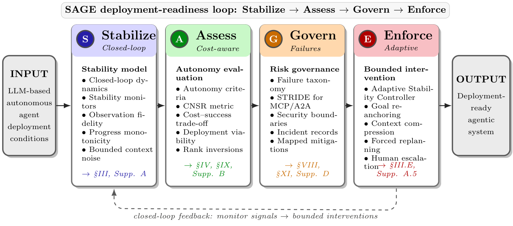

<div align="center">

# SAGE

### A Stabilize–Assess–Govern–Enforce Framework for Deployment-Oriented Evaluation of LLM-Based Autonomous Agents

[](#paper)
[](LICENSE)
[](https://www.python.org/downloads/)
[](pyproject.toml)
[](https://github.com/MHHamdan/SAGE/actions/workflows/ci.yml)
[](https://github.com/psf/black)

**Official implementation of the SAGE framework — a deployment-oriented evaluation instrument for LLM-based autonomous agents.**

[Overview](#overview) · [Architecture](#framework-architecture) · [Contributions](#key-contributions) · [Paper](#paper) · [Install](#installation) · [Quick Start](#quick-start) · [Experiments](#experiments) · [Reproducibility](#reproducibility) · [Cite](#citation)

</div>

---

SAGE evaluates an LLM-based agent as a **non-stationary closed-loop controller** rather than as a static reasoner scored on task success. It supplies four coupled operational capacities — stability monitoring (**S**tabilize), cost-aware assessment (**A**ssess), failure and protocol governance (**G**overn), and bounded corrective control (**E**nforce) — over a shared instrumentation layer, so that the same monitor signals that diagnose instability also drive the corrective controller, and the cost model used for ranking also prices the corrections.

This repository is the reference implementation accompanying the IEEE Transactions on Artificial Intelligence paper of the same name. It contains the framework code, the paper's experiments, the committed result artifacts, and the scripts that regenerate every table and figure.

---

## Overview

### The growth of autonomous LLM agents

LLM-based agents have moved from passive question answering to active, goal-directed operation: they perceive an environment, reason over objectives, invoke tools, and execute multi-step plans across software engineering, web interaction, and end-to-end professional workflows. That transition is an architectural change, not merely a capability increase — the system becomes feedback-driven, its behavior at step 100 conditioned on everything accumulated in context since step 0.

### What current evaluation misses

Agent evaluation is still dominated by task-success benchmarks. Those benchmarks characterize *capability*, and they remain essential, but by themselves they do not characterize *deployment behavior*. Four properties fall outside them:

| Unmeasured property | Consequence in deployment |
|---|---|
| **Instability under feedback** | Goal drift, oscillation and limit cycles, and state misestimation accumulate silently across long horizons; a success rate reports only the terminal outcome. |
| **Operating cost** | Success rates are typically reported separately from inference, tool, latency, and human-escalation cost, so a configuration can lead a leaderboard while being the least economical to run. |
| **Protocol-level exposure** | Standardized agent interfaces (MCP, A2A) introduce trust boundaries — tool outputs entering context, capabilities forwarded between agents — that task benchmarks do not probe. |
| **Effect of corrective action** | Benchmarks measure the uncontrolled agent. They say nothing about whether a monitored, intervened agent behaves differently, or what that intervention costs. |

### Why deployment-oriented assessment

Deployment readiness is a property of the *loop*, not of the model in isolation. An agent that succeeds 82% of the time on a benchmark may drift to complete failure on a 50-turn task, cost 30× more per success than a weaker configuration, and expose a critical prompt-injection surface at its tool boundary — none of which the benchmark number reveals. Regulatory frameworks including the EU AI Act and the NIST AI Risk Management Framework further motivate explicit capability characterization and governance structure alongside accuracy.

### What SAGE contributes

SAGE organizes the four missing capacities into one instrument that **layers onto existing benchmarks rather than replacing them**. CNSR can be computed on top of any benchmark's outcomes; the stability monitors instrument the agent loop the benchmark already runs; the failure taxonomy classifies the incidents it produces; and the controller acts on the monitor signals it emits.

The framework's claims are deliberately bounded. The stability conditions are stated as *sufficient design targets and monitoring criteria*, not formal guarantees. The Adaptive Stability Controller is an *engineering mechanism with bounded interventions*, not a proof of recovery. The empirical findings are specific to the evaluated task families and should not be generalized without further validation — a limit the paper's own second-dataset evaluation makes concrete (see [Where the framework does not help](#where-the-framework-does-not-help)).

---

## Framework Architecture



*The SAGE framework for deployment-oriented analysis of LLM-based autonomous agents. The four pillars connect stability monitoring, cost-aware assessment, protocol governance, and bounded corrective control through a feedback path from monitor signals to interventions. (Fig. 1 of the paper; vector source in [`paper/public/sage_framework.pdf`](paper/public/sage_framework.pdf).)*

The pillars are sequentially connected and share a common instrumentation layer. Monitor signals that diagnose instability (*Stabilize*) feed the corrective controller (*Enforce*); the cost accounting used for assessment (*Assess*) prices the interventions the controller dispatches; and each class in the failure taxonomy (*Govern*) is associated with a monitor signal and, where applicable, a bounded intervention.

### Closed-loop model

The agent is modeled as a discrete-time stochastic dynamical system over state, action, observation, and context spaces $(\mathcal{S}, \mathcal{A}, \mathcal{O}, \mathcal{C})$:

$$o_t \sim \mathcal{O}_{\mathrm{obs}}(\cdot \mid s_t), \qquad \hat{s}_t = f_{\mathrm{enc}}(C_{t-1}, o_t), \qquad a_t \sim \pi_\theta(\cdot \mid \hat{s}_t, g, C_{t-1}), \qquad s_{t+1} \sim P(\cdot \mid s_t, a_t), \qquad C_t = \mathcal{U}(C_{t-1}, o_t, a_t)$$

Three properties separate this from classical control. The policy is **non-stationary from the loop's perspective**: $\theta$ is frozen, but $\pi_\theta(\cdot \mid \cdot, \cdot, C_{t-1})$ depends on an accumulating context, so the effective controller at $t{=}100$ differs from the one at $t{=}0$. Inference introduces **stochasticity and decision-cycle latency**, so identical inputs may yield different actions and $o_t$ may be stale when $a_t$ commits. And unlike classical control, where an explicit error $e_t = g - \hat{s}_t$ drives the controller, **the LLM computes error implicitly** through attention over $g$ and $\hat{s}_t$ inside $C_{t-1}$ — the error is not a measurable, intervenable signal unless a monitor is added. Adding that monitor is what the rest of the framework builds on.

<div align="center">

</div>

---

### Stabilize

**Purpose.** Make instability observable. The pillar characterizes the agent as a closed-loop controller and states three *sufficient* conditions under which expected goal similarity increases until convergence — each mapped to a scalar monitor signal whose violation indicates elevated risk of a specific failure class.

**Conditions and their mechanisms.**

| Condition | Formal target | Failure mechanism when violated |
|---|---|---|
| **Observation fidelity** | State-estimation error $\delta_o$ between $\hat{s}_t$ and $s_t$ is bounded | Hallucinated or malformed tool output; $\hat{s}_t$ diverges from $s_t$ |
| **Progress monotonicity** | Expected per-step progress $\delta_p$ toward the goal is strictly positive | Deadlock or limit cycles — the agent acts without advancing |
| **Bounded context noise** | Context degradation $\delta_c$ is bounded | Goal drift as earlier task-relevant tokens are displaced from context |

**Mechanism.** Each condition is operationalized as a monitor signal computed per turn. The goal-drift signal compares the original goal $g_0$ against an estimate $\hat{g}_t$ of the currently pursued goal, re-encoded from the active task framing in $C_t$:

$$\mathrm{Drift}_t = \tfrac{1}{2}\bigl(1 - \cos(\mathrm{emb}(g_0),\, \mathrm{emb}(\hat{g}_t))\bigr) \in [0,1]$$

By construction $\mathrm{Drift} = 0$ for identical embeddings, $1/2$ for orthogonal, and $1$ for anti-aligned; unit tests assert these three sentinel values exactly. The four signals the controller consumes are:

| Signal | Computation | Calibration used in the paper |
|---|---|---|
| **Drift** | $\tfrac{1}{2}(1-\cos(e_g, e_t))$ over initial and current goal embeddings | Hand-tuned threshold; sentinels unit-tested |
| **Oscillation** | Overlap between the most recent $k$ actions and the preceding $k$ | Sliding window $k{=}5$, bound $B{=}3$; low-cost limit-cycle alarm |
| **Fidelity** | Schema validation of tool outputs and declared interfaces | Binary pass/fail — a useful local alarm, **not** a five-step predictor |
| **Convergence** | Change in goal-state similarity over time | Progress feature in the predictive head; needs task-specific calibration |

**Important scope limit.** These are sufficient design targets, not guarantees: the semantic-similarity surrogate may not capture goal satisfaction exactly, finite context limits are not modeled, and policy non-stationarity complicates the analysis. Their value is diagnostic.

**Code:** [`src/sage/monitoring/stability_monitor.py`](src/sage/monitoring/stability_monitor.py), [`src/sage/stability/`](src/sage/stability), [`src/sage/evaluation/goal_drift.py`](src/sage/evaluation/goal_drift.py)

---

### Assess

**Purpose.** Add economic cost as an explicit evaluation dimension, and separate genuine agents from pseudo-agentic workflows.

**Evaluation methodology — CNSR.** For task $\tau$ drawn from a deployment distribution $\mathcal{D}$, with success $Y(\tau) \in \{0,1\}$ and total cost $C_{\mathrm{total}}(\tau) > 0$ decomposing additively into inference, tool, latency, and human-escalation components, the **Cost-Normalized Success Rate** is the ratio of expectations:

$$\mathrm{CNSR} := \frac{\mathbb{E}_{\tau \sim \mathcal{D}}[Y(\tau)]}{\mathbb{E}_{\tau \sim \mathcal{D}}[C_{\mathrm{total}}(\tau)]} \quad \text{[successful completions per \$]}$$

estimated by the plug-in ratio $\widehat{\mathrm{SR}} / \bar{C}_{\mathrm{total}}$ with BCa bootstrap confidence intervals over the task index.

CNSR is **ratio-valued, not a percentage** — its units are completions per dollar, so large values reflect a low cost denominator, not high accuracy. The induced ranking is invariant to common positive rescaling of $C_{\mathrm{total}}$, but *not* to provider repricing, different latency weights, or different escalation costs. Read it as a transparent cost-normalized comparison under stated assumptions, and recompute it with current prices for any deployment decision.

Concretely: a system at 80% success and \$0.50/task ($\mathrm{CNSR} = 1.60$) delivers 3.5× the cost-normalized performance of one at 90% success and \$2.00/task ($\mathrm{CNSR} = 0.45$) — a trade-off invisible in a success-only report.

**Behavioral autonomy criteria.** Not all LLM automation is agentic. Four behavioral criteria are treated as minimum requirements: *action selection freedom* (choosing among actions from state assessment rather than predetermined branching), *goal-directed persistence* (continued pursuit with adaptive strategy), *dynamic termination* (self-determined completion on goal satisfaction rather than a fixed step count), and *error recovery* (autonomous response to failure without a scripted fallback). Scripted chains and template-driven workflows can appear adaptive while failing one or more criteria.

The pillar also distinguishes **autonomy level** (an intrinsic agent property, Levels 1–5) from **human involvement** (an operational characteristic). Human-in-the-Loop (L1) and Human-on-the-Loop (L2) do not satisfy the agency criteria; the transition occurs at **Level 3, Bounded Autonomy** — the minimum threshold for agentic behavior.

<div align="center">

</div>

**Code:** [`src/sage/evaluation/metrics.py`](src/sage/evaluation/metrics.py) (`compute_cnsr`, `TaskCostBreakdown`), [`src/sage/evaluation/cnsr_benchmark.py`](src/sage/evaluation/cnsr_benchmark.py), [`src/sage/evaluation/autonomy_validator.py`](src/sage/evaluation/autonomy_validator.py), [`eval/metrics.py`](eval/metrics.py) (dependency-light shim)

---

### Govern

**Purpose.** Give deployment incidents a shared vocabulary and give interoperability boundaries a threat model.

**Governance principle — every failure class carries a monitor and a mitigation.** The taxonomy is not a descriptive list. Each of the ten pathology classes is mapped to an evaluation method, a mitigation, a documented real-world example, and — the load-bearing part — a monitor signal from *Stabilize* and, where applicable, a bounded intervention from *Enforce*:

| # | Failure class | Evaluation method | Mitigation |
|---|---|---|---|
| 1 | Hallucinated affordance | Schema checks | Strict allowlisting, capability verification |
| 2 | Specification gaming | Adversarial objective testing | Robust reward design, comprehensive specs |
| 3 | Goal drift | Goal-drift score tracking | Periodic goal re-anchoring, drift monitoring |
| 4 | State misestimation | Observation consistency tests | Explicit state verification, freshness checks |
| 5 | Credit misassignment | Causal outcome analysis | Explicit attribution mechanisms |
| 6 | Cascading failure | Fault injection testing | Circuit breakers, error boundaries |
| 7 | Safety violation | Policy compliance testing | Guardrails, policy enforcement |
| 8 | Irreversible action | Impact analysis testing | Approval gates, confirmation requirements |
| 9 | Resource exhaustion | Resource monitoring | Budgets, limits, cost tracking (CNSR) |
| 10 | Permission escalation | Privilege audit testing | Capability authorization, least privilege |

That the mapping is functionally load-bearing rather than descriptive is measured, not asserted: removing it in the leave-one-out pillar ablation leaves the controller firing at the right times but recovering only **9.2%** of tasks, against 84.4% for the full framework.

**Protocol risk modeling.** A STRIDE analysis of default MCP and A2A configurations identifies **eleven threat vectors** with mapped mitigations, of which **four are rated critical**:

| ID | Threat | Protocol | Mitigation |
|---|---|---|---|
| `MCP-I02` | Prompt injection via tool output | MCP | Output sanitization, filtering |
| `MCP-E01` | Capability escalation | MCP | Scoped tokens, least privilege |
| `A2A-E01` | Cross-agent escalation | A2A | Capability intersection |
| `A2A-E02` | Credential forwarding | A2A | Scope reduction, non-transferable tokens |

Threat vectors map to a layered boundary model — model, runtime, tool, agent, and organizational — so that each critical vector is contained at a distinct boundary and defenses compose rather than duplicate. Prompt injection through tool outputs is the most consequential because injected content enters context as ordinary tool data; it must therefore be mitigated at the *model* boundary, not the transport layer.

The catalog is a descriptive threat model, not a security guarantee — with one exception. `MCP-I02`, the single most critical vector, is implemented and tested: an output-boundary sanitizer reduces attack success from **86.3% to 10.2%** over 800 trials with non-overlapping Wilson intervals ([`results/mcp_i02/`](results/mcp_i02)).

**Code:** [`src/sage/evaluation/failure_taxonomy.py`](src/sage/evaluation/failure_taxonomy.py), [`src/sage/evaluation/pathology_benchmarks.py`](src/sage/evaluation/pathology_benchmarks.py), [`src/sage/security/threat_validator.py`](src/sage/security/threat_validator.py), [`src/sage/protocols/`](src/sage/protocols)

---

### Enforce

**Purpose.** Close the loop. Monitors are a sensor; they are not a controller. The **Adaptive Stability Controller (ASC)** sits between the monitor and the agent's next action, consumes the monitor signal vector each turn, and dispatches one of a bounded set of interventions intended to reduce monitored risk before the task terminates in failure.

**Deployment reliability mechanisms — five bounded interventions.** Each carries a declared dollar cost (which enters CNSR), a reversibility flag, and a per-task budget cap:

| Intervention | Action |
|---|---|
| `GoalReanchor` | Re-inject the original goal with a partial recovery pull on the current state representation |
| `ContextCompress` | Summarize and prune turns older than a window |
| `ForceReplan` | Discard and regenerate the current plan |
| `SchemaValidatedRetry` | Re-check the latest tool output against its declared schema; retry with corrected arguments on failure |
| `HumanEscalate` | Raise an escalation request and end the loop |

**Two safeguards bound controller-induced oscillation:** every non-trivial intervention is subject to a **cooldown**, and a per-task **budget $M$** caps the number of firings. These are engineering constraints that reduce thrashing and keep the comparison interpretable; they are not a formal stability guarantee for the agent–monitor–controller composition.

**Four control policies** share the same monitor and intervention library, isolating the effect of *timing and selection*:

| Policy | Behavior | Role |
|---|---|---|
| `NoControl` | No-op every turn | Open-loop baseline |
| `FixedSchedule(k)` | Re-anchor every $k$ turns regardless of signals | Non-adaptive baseline |
| `Threshold(θ)` | Fire the intervention for the first monitor crossing its hand-tuned threshold, with cooldown | Hand-tuned closed-loop |
| `Predictive(φ)` | Consume the monitor vector through a calibrated head estimating $P(\text{failure within } k \text{ turns})$ and fire preemptively | Learned closed-loop |

The predictive head is a logistic regression over eight features — the four monitor signals, their first-order deltas, and a running maximum of the drift score — trained on offline traces with task-stratified five-fold cross-validation, with an anti-leakage assertion that task identifiers never co-occur across folds.

**Runtime cost is negligible.** Each predictive decision takes **0.151 ms** on average (0.225 ms at p95) and the logistic head occupies **272 bytes** — below 0.02% of a realistic multi-second turn ([`results/asc_overhead/`](results/asc_overhead)).

**Code:** [`src/sage/stability/controller.py`](src/sage/stability/controller.py), [`src/sage/stability/interventions.py`](src/sage/stability/interventions.py), [`src/sage/stability/predictor.py`](src/sage/stability/predictor.py), [`src/sage/stability/traces.py`](src/sage/stability/traces.py)

---

## Key Contributions

1. **A control-theoretic characterization of LLM-based agents** as non-stationary closed-loop controllers, with three sufficient stability conditions — observation fidelity, progress monotonicity, and bounded context noise — stated as design targets and operationalized as monitorable indicators.

2. **The CNSR metric**, evaluated across seven model configurations and three task categories, showing that capability-only rankings can invert under cost normalization (Kendall's $\tau = -0.429$ averaged across task types). The configuration with the highest raw success rate ranked *last* by CNSR in every category.

3. **A ten-class failure taxonomy and a STRIDE analysis of MCP and A2A** identifying eleven threat vectors with mapped mitigations, of which the most critical (`MCP-I02`) is implemented and empirically evaluated.

4. **An implemented and evaluated Adaptive Stability Controller** that consumes monitor signals as feedback and dispatches bounded interventions, evaluated against three baselines on a held-out long-horizon suite: completion rose from 2.0% under open-loop execution to 89.3% (hand-tuned) and 83.3% (learned).

**Deployment perspective.** The operational message is integrative, not replacement: cost monitoring, drift detection, bounded closed-loop intervention, and failure-mode-aware deployment can be layered onto existing benchmark infrastructure.

**Claims are bounded by three reported negative findings**, which constrain the claim space rather than refute the framework: the schema-fidelity monitor contributes no signal beyond chance at the five-step horizon (AUC 0.495, $p = 0.760$); the lead-time trade-off is shaped by a simulator artifact; and the predictive controller's 30.2% cost overhead exceeds its 25% pre-registered target.

---

## Results

All numbers below are reproduced by the committed artifacts under [`results/`](results) and regenerated by the commands in [Experiments](#experiments).

### E4 — closed-loop ablation (50 held-out long-horizon tasks × 4 conditions × 3 seeds)

| Controller | Completion (95% CI) | Cost | CNSR | Interv./task |
|---|---|---|---|---|
| `NoControl` | 2.0% [0.0, 4.7] | 1.000 | 0.020 | 0.0 |
| `FixedSchedule(k=10)` | 36.7% [29.3, 44.7] | 1.050 | 0.349 | 5.0 |
| `Threshold` | **89.3%** [84.0, 94.0] | 1.416 | 0.631 | 9.7 |
| `Predictive` | 83.3% [77.3, 88.7] | 1.302 | **0.640** | 5.6 |

Two effects separate cleanly: bounded interventions improve over open-loop execution, and *adapting their timing to monitor signals* improves over a fixed schedule (36.7% → ≥83%). `Threshold` and `Predictive` are both Pareto-optimal at distinct operating points and are statistically indistinguishable on CNSR (0.631 vs 0.640) — the choice between them is a deliberate cost–completion trade-off, not algorithmic dominance. McNemar $p < 10^{-4}$ for both completion comparisons after Holm–Bonferroni correction; Cohen's $h = 2.017$ for `Predictive` vs `NoControl`.

*Data source: simulation — a seeded goal-drift model with no LLM calls, deliberately isolating the mechanism.*

<div align="center">


</div>

### E5 — predictive monitor validation (300 traces, 5-fold task-stratified CV)

| Predictor | AUC @ $k{=}5$ | Verdict |
|---|---|---|
| Combined (logistic, 8 features) | **0.752** | +0.143 over best single signal — directional |
| Drift | 0.609 | Above chance ($p < 10^{-4}$) |
| Oscillation | 0.589 | Above chance ($p < 10^{-4}$) |
| Schema fidelity | 0.495 | **Not above chance** ($p = 0.760$) |

The combined monitor is useful at the evaluated lead times. Schema fidelity is not a long-horizon predictor in these data and is better treated as a single-step alarm — which is exactly the regime in which it is informative (it fires on an empty knowledge-base result before the agent improvises). AUC *rose* marginally with lead time ($0.744 \to 0.752 \to 0.771$), an artifact of a simulator in which induced violations accumulate monotonically; deployed agents should be expected to show the usual degradation profile.

### CNSR rank inversion (7 configurations × 3 task categories, 50 tasks/cell, 3 seeds)

Kendall's $\tau$ between success-rate and CNSR rankings: **−0.429** code, **−0.238** web, **−0.619** research ($p = 0.069$). Negative $\tau$ indicates rank inversion. The highest-success configuration (GPT-4-Turbo, 76%/57%/82% SR) ranked 7th of 7 by CNSR in every category; the CNSR leader achieved competitive success at substantially lower per-token cost. Given the modest number of configurations, this is presented as a proof-of-concept of cost–capability divergence, not a significance-backed law.

### Pillar ablation (leave-one-out, 250 evaluations per variant)

| Variant | Completion | Δ vs full | Cohen's $h$ |
|---|---|---|---|
| Full SAGE | 84.4% | — | — |
| − Stabilize | 1.6% | −82.8 pp | 2.076 |
| − Enforce | 1.6% | −82.8 pp | 2.076 |
| − Govern | 9.2% | −75.2 pp | 1.713 |
| − Assess | 69.2% | −15.2 pp | 0.365 |

Removing monitoring or enforcement collapses completion to the open-loop floor. Removing the taxonomy→intervention mapping leaves the controller firing at the right *times* but choosing the wrong *actions* — evidence that *Govern* is functionally load-bearing.

### Where the framework does not help

The paper's second-dataset evaluation is reported as it fell. On HotpotQA-distractor multi-hop QA with real open-weight models (4 policies × 5 seeds × 50 eval tasks, agent `llama3.1:8b`), **no controller produces a significant lift** (all $|h| < 0.10$, all CIs overlap) and the predictor is at chance (CV-AUC 0.494).

The diagnosis is the useful part: on this family, oscillation is a *symptom*, not a recoverable derailment — $P(\text{success} \mid \text{oscillated}) = 31.4\% \approx P(\text{success} \mid \text{not}) = 37.0\%$ — and breaking the loop discards accumulated reasoning. Short-horizon retrieval QA failures are **capability-limited**, not the recoverable goal drift the controller is built for.

**This bounds the operating envelope of the *Enforce* pillar: closed-loop control helps where failures are recoverable derailments, and does not where they are capability limits.** The CNSR rank inversion, by contrast, *does* reproduce on real open-weight models (Kendall's $\tau_b = -0.527$, $n = 5$). Full report: [`results/ollama_real/REPORT.md`](results/ollama_real/REPORT.md).

---

## Paper

> **SAGE: A Stabilize–Assess–Govern–Enforce Framework for Deployment-Oriented Evaluation of LLM-Based Autonomous Agents**
> Mohammed H. Hamdan
> *IEEE Transactions on Artificial Intelligence*, 2026 (accepted).

- **IEEE Xplore:** _link to be added upon publication_ — `https://doi.org/10.1109/TAI.XXXX.XXXXXXX`
- **Architecture figure (vector):** [`paper/public/sage_framework.pdf`](paper/public/sage_framework.pdf)

### Paper → code map

| Paper section | Content | Implementation |
|---|---|---|
| §III — Overview | Four coupled pillars, shared instrumentation | [`src/sage/`](src/sage) |
| §IV — Stabilize | Closed-loop model, three stability conditions, monitor definitions | [`src/sage/monitoring/`](src/sage/monitoring), [`src/sage/stability/`](src/sage/stability) |
| §V — Assess | CNSR, autonomy criteria, capability levels, oversight trade-offs | [`src/sage/evaluation/`](src/sage/evaluation), [`eval/metrics.py`](eval/metrics.py) |
| §VI — Govern | Ten-class failure taxonomy, STRIDE for MCP/A2A, security boundaries | [`src/sage/evaluation/failure_taxonomy.py`](src/sage/evaluation/failure_taxonomy.py), [`src/sage/security/`](src/sage/security) |
| §VII — Enforce | ASC, five interventions, four control policies, Algorithm 1 | [`src/sage/stability/controller.py`](src/sage/stability/controller.py) |
| §VIII — Evaluation | E4 closed-loop ablation, E5 predictive monitor validation | [`experiments/e4_closed_loop.py`](experiments/e4_closed_loop.py), [`experiments/e5_predictive_validation.py`](experiments/e5_predictive_validation.py) |
| Supp. B | A1–A3 stability-condition violation experiments | [`experiments/exp_obs_fidelity.py`](experiments/exp_obs_fidelity.py), [`exp_progress_mono.py`](experiments/exp_progress_mono.py), [`exp_context_noise.py`](experiments/exp_context_noise.py) |
| Supp. H | Revision experiments (real models, ablation, sensitivity, security) | [`experiments/revision/`](experiments/revision) |

---

## Repository Structure

```
SAGE/
├── src/sage/                       # Installable package (import name: sage)
│   ├── core/                       # Base agent, control loop, LLM client, cost tracking,
│   │                               #   backends (litellm | ollama | simulator), seeding
│   ├── stability/                  # ENFORCE (+ S): closed-loop control
│   │   ├── controller.py           #   NoControl / FixedSchedule / Threshold / Predictive
│   │   ├── interventions.py        #   The five bounded interventions
│   │   ├── predictor.py            #   Calibrated logistic failure head + feature extraction
│   │   └── traces.py               #   Trace writer / reader for offline training
│   ├── monitoring/                 # STABILIZE: StabilityMonitor (drift, oscillation,
│   │                               #   monotonicity, observation fidelity)
│   ├── evaluation/                 # ASSESS + GOVERN
│   │   ├── metrics.py              #   compute_cnsr(), TaskCostBreakdown, MetricsCollector
│   │   ├── cnsr_benchmark.py       #   CNSRBenchmark: Pareto, rank divergence, sensitivity
│   │   ├── goal_drift.py           #   goal_drift_score()
│   │   ├── autonomy_validator.py   #   Four behavioral autonomy criteria
│   │   ├── failure_taxonomy.py     #   GOVERN: ten pathology classes + detectors
│   │   └── pathology_benchmarks.py #   GOVERN: pathology benchmark runner
│   ├── security/                   # GOVERN: STRIDE threat validator (11 vectors, MCP + A2A)
│   ├── protocols/                  # MCP client/server, A2A communication
│   ├── agents/                     # ReAct, multi-agent, supervisor
│   ├── benchmarks/                 # SWE-Bench, HotpotQA, AgentBench adapters
│   ├── human_oversight/            # Approval flows, escalation, audit trails
│   ├── planning/ memory/ skills/   # Reactive/deliberative/HTN planners; memory; skill registry
│   ├── tools/ verification/        # Tool registry, sandboxing; plan validator, policy engine
│   ├── learning/ context/ utils/   # Deployment loop, feedback; context management
│   └── __init__.py
│
├── experiments/                    # Paper experiments — one file per result
│   ├── exp_obs_fidelity.py         #   A1: observation-fidelity violation
│   ├── exp_progress_mono.py        #   A2: progress-monotonicity violation
│   ├── exp_context_noise.py        #   A3: context-noise / goal-drift violation
│   ├── cnsr_multitask.py           #   CNSR: 7 configs × 3 task types × 3 seeds
│   ├── judge_bias.py               #   LLM-as-judge bias measurement
│   ├── e4_closed_loop.py           #   E4: closed-loop ASC ablation
│   ├── e5_predictive_validation.py #   E5: predictive monitor validation
│   └── revision/                   #   Supplementary H: real-model + robustness studies
│       ├── ollama_2a.py 2b.py p1.py#     Open-weight models on HotpotQA (local, zero cost)
│       ├── api_cnsr.py             #     Metered-API CNSR ladder
│       ├── pillar_ablation.py      #     Leave-one-out pillar ablation
│       ├── mcp_i02_attack.py       #     MCP-I02 prompt-injection attack + sanitizer
│       ├── asc_overhead.py         #     Controller latency / memory overhead
│       ├── cnsr_sensitivity.py     #     CNSR cost-parameter sensitivity
│       ├── e4_threshold_surface.py #     E4 threshold-sensitivity surface
│       └── e5_monitor_errors.py    #     Monitor confusion matrix / PR analysis
│
├── eval/                           # Dependency-light metrics shim (no LangChain needed)
├── configs/                        # YAML: default.yaml, models.yaml, experiments/*.yaml
├── scripts/                        # generate_latex.py (tables), env_report.py (provenance)
├── tests/                          # Test suite, mirrors the src/sage/ layout
├── examples/                       # Runnable examples + end-to-end use cases
├── dashboard/                      # Optional FastAPI + React monitoring dashboard
├── results/                        # Committed result artifacts (CSV, JSON, traces, figures)
├── docs/assets/                    # Figures used by this README
├── paper/public/                   # Publication figures (vector sources)
├── Dockerfile  Makefile            # Reproducible environment and task runner
├── pyproject.toml requirements.txt # Packaging and pinned-floor dependencies
├── CITATION.cff  CHANGELOG.md      # Citation metadata and release history
└── .github/workflows/ci.yml        # Lint, test matrix (3.10–3.12), build, experiment smoke
```

---

## Installation

Requires **Python 3.10, 3.11, or 3.12**.

```bash
git clone https://github.com/MHHamdan/SAGE.git
cd SAGE
```

Pick the extra that matches what you intend to do:

```bash
# Core framework only
pip install -e .

# Reproducing the paper's experiments (numpy, scipy, pandas, matplotlib,
# seaborn, litellm, sentence-transformers) — this is what you want to
# regenerate results/
pip install -e ".[experiments]"

# Development (pytest, black, isort, mypy, ruff)
pip install -e ".[dev]"

# Everything
pip install -e ".[all]"
```

Optional extras: `google` (Google ADK / GenAI), `a2a` (A2A SDK + server), `observability` (LangSmith), `paper` (figure/table generation only).

`requirements.txt` mirrors the `[experiments]` extra with the same version floors, for environments that install from a requirements file rather than the package.

### Docker

```bash
docker build -t sage-framework .

# Run the test suite inside the image
docker run --rm sage-framework pytest tests/

# Run a paper experiment; mount ./results to keep the output
docker run --rm -v "$PWD/results:/app/results" sage-framework \
  python experiments/e4_closed_loop.py --seed 42
```

The image pins `python:3.11-slim`, sets `SEED=42` and `PYTHONHASHSEED=0`, and defaults `OLLAMA_HOST` to `http://host.docker.internal:11434` for local open-weight runs.

### Credentials

No API keys are needed for the simulated experiments, the test suite, or any of the framework's core paths.

```bash
cp .env.example .env      # then fill in only the providers you actually use
```

`.env` is gitignored. Credentials are read exclusively from the environment via `python-dotenv` — no key material lives in code, and experiments that require credentials fail loudly rather than silently degrading.

---

## Quick Start

Every snippet below was executed against this repository's code before being published.

### Assess — Cost-Normalized Success Rate

```python
from sage.evaluation import calculate_cnsr, evaluate_agent

# CNSR = success rate / mean cost per task  →  completions per dollar
cnsr = calculate_cnsr(successes=80, total_tasks=100, total_cost=50.0)
print(f"CNSR: {cnsr:.2f}")                     # CNSR: 1.60

result = evaluate_agent(successes=80, total_tasks=100, total_cost=50.0)
print(f"SR={result.success_rate:.2%}  "
      f"mean_cost=${result.mean_cost:.2f}  "
      f"CNSR={result.cnsr:.2f}")               # SR=80.00%  mean_cost=$0.50  CNSR=1.60
```

### Stabilize — instrument the agent loop

```python
import numpy as np
from sage.monitoring.stability_monitor import create_stability_monitor

def embed(text: str) -> np.ndarray:
    """Replace with your own encoder (e.g. sentence-transformers)."""
    v = np.zeros(64)
    for tok in text.split():
        v[hash(tok) % 64] += 1.0
    n = np.linalg.norm(v)
    return v / n if n else v

monitor = create_stability_monitor(
    goal_text="summarize the quarterly report",
    embedding_fn=embed,
    oscillation_window=5,     # sliding window k
    oscillation_bound=3,      # bound B
)

for t in range(12):
    action = "search" if t % 2 else "read"     # a deliberate two-action limit cycle
    monitor.track_state(
        state_embedding=embed(f"step {t} {action}"),
        action=action,
        observation={"ok": True},
    )

print("oscillating:", monitor.check_oscillation().oscillating)   # oscillating: True
report = monitor.get_stability_report()
print("steps:", report.total_steps, "| recommendations:", report.recommendations)
```

### Enforce — decide on an intervention

```python
from sage.stability.controller import (
    NoControl, FixedScheduleController, ThresholdController,
    PredictiveController, MonitorSignals,
)

controller = ThresholdController(drift_threshold=0.3, oscillation_threshold=0.6)

signals = MonitorSignals(
    drift_score=0.42, oscillation_score=0.10, fidelity_score=1.0,
    convergence_progress=0.05, turn=17, cost_so_far=0.83,
)
decision = controller.decide(signals)
print(decision.intervention.name)   # GoalReanchor
print(decision.rationale)           # drift=0.420 > threshold=0.3
```

All four policies implement the same `decide(signals) -> InterventionDecision` protocol, so they are drop-in substitutable — which is what makes the E4 ablation a clean comparison. `decision.intervention is None` means no-op.

### Govern — taxonomy and threat catalog

```python
from sage.evaluation.failure_taxonomy import FailurePathology
from sage.security.threat_validator import ALL_THREATS, ThreatSeverity

print("failure classes:", len(list(FailurePathology)))   # failure classes: 10

critical = [t for t in ALL_THREATS if t.severity == ThreatSeverity.CRITICAL]
print("threat vectors:", len(ALL_THREATS), "| critical:", len(critical))
#                        threat vectors: 11 | critical: 4
for t in critical:
    print(f"  {t.threat_id}  {t.name}")
#   MCP-E01  Capability Escalation
#   MCP-I02  Prompt Injection via Tool Output
#   A2A-E01  Cross-Agent Escalation
#   A2A-E02  Credential Forwarding
```

More complete programs — a ReAct agent, memory systems, multi-agent pipelines, security policies, protocol integration — are in [`examples/`](examples).

---

## Experiments

### Workflow

Every experiment follows the same four-stage pipeline, which is why results are reproducible without re-running anything by hand:

```
configs/*.yaml  ──►  experiments/*.py  ──►  results/<experiment>/  ──►  scripts/generate_latex.py
   parameters          seeded run            CSV + MANIFEST.json          LaTeX tables + figures
                                             + raw traces (JSONL)
```

1. **Configure** — parameters live in `configs/` or as CLI flags; every script takes an explicit `--seed`.
2. **Run** — each script seeds NumPy and Python RNGs through `sage.core.seeding.set_global_seed`, executes the study, and writes a directory under `results/`.
3. **Record** — alongside the CSV summary, each run writes a `MANIFEST.json` capturing the git SHA, seed, parameters, and library versions, plus raw per-episode JSONL traces where applicable.
4. **Report** — `scripts/generate_latex.py` turns the committed CSVs into the exact LaTeX table fragments used in the paper.

### Evaluation pipeline

The three backends are selected explicitly, never inferred, so an experiment can never silently degrade from a real run to a simulated one:

| Backend | Flag | Cost | Requires |
|---|---|---|---|
| **Simulator** | `--backend simulator` | Free | Nothing — seeded, deterministic, offline |
| **Local open weights** | `--backend ollama` | Free | A running Ollama server (`OLLAMA_HOST`) |
| **Hosted APIs** | `--backend litellm` | **Metered** | Provider credentials in `.env`; raises if absent |

### Running the experiments

```bash
# --- Stability-condition violations (Supp. B, A1-A3) --------------------------
python experiments/exp_obs_fidelity.py   --trials 20 --seed 42   # → results/exp_a1.csv
python experiments/exp_progress_mono.py  --trials 20 --seed 42   # → results/exp_a2.csv
python experiments/exp_context_noise.py  --trials 10 --seed 42   # → results/exp_a3.csv

# --- Assess: CNSR across configurations and task types ------------------------
python experiments/cnsr_multitask.py --backend simulator --seeds 0 1 2
#   → results/cnsr_multitask.csv, results/cnsr_table.tex
#   Use --backend litellm for a real metered run on your own keys.

# --- Enforce: E4 closed-loop ablation -----------------------------------------
python experiments/e4_closed_loop.py --seed 42
#   → results/e4_closed_loop/{summary.csv, REPORT.md, MANIFEST.json, figures/, raw_traces/}

# --- Stabilize: E5 predictive monitor validation ------------------------------
python experiments/e5_predictive_validation.py --seed 42
#   → results/e5_predictive/{summary.csv, REPORT.md, MANIFEST.json, predictors/, figures/}

# --- LLM-as-judge bias --------------------------------------------------------
python experiments/judge_bias.py --seed 42        # → results/judge_bias.csv, judge_bias.tex

# --- Regenerate every LaTeX table fragment from committed CSVs -----------------
python scripts/generate_latex.py                  # → results/table_fragments.tex
```

Revision studies (Supplementary H) live under `experiments/revision/`:

```bash
python experiments/revision/pillar_ablation.py      # → results/pillar_ablation/
python experiments/revision/mcp_i02_attack.py       # → results/mcp_i02/
python experiments/revision/asc_overhead.py         # → results/asc_overhead/
python experiments/revision/cnsr_sensitivity.py     # → results/cnsr_sensitivity/
python experiments/revision/e4_threshold_surface.py # → results/e4_threshold_surface/
python experiments/revision/e5_monitor_errors.py    # → results/e5_monitor_errors/

# Real open-weight runs — require a local Ollama server, cost nothing
python experiments/revision/ollama_smoke.py         # connectivity check first
python experiments/revision/ollama_2a.py --temp 0.0 # → results/ollama_real/2A/
python experiments/revision/ollama_2b.py            # → results/ollama_real/2B/
```

Or through the Makefile:

```bash
make install      # pip install -e ".[dev]"
make test         # full suite
make results      # regenerate tables + figures
make env-report   # environment/provenance report (text; env-report-json for JSON)
make validate     # determinism check
make docker-build # build the reproducible image
make help         # all targets
```

### Result generation

Results are **committed**, so the paper's numbers can be checked without spending compute or money. Each run directory carries a `MANIFEST.json` with the git SHA, seed, and library versions used to produce it, and E4 additionally ships per-episode `raw_traces/*.jsonl` for independent re-analysis. Re-running a script with the same `--seed` overwrites its output directory with byte-identical content for the simulator backend.

---

## Reproducibility

### Environment

| | |
|---|---|
| **Python** | 3.10, 3.11, or 3.12 (CI tests all three; results produced on 3.11) |
| **OS** | Linux (developed and validated on Ubuntu); macOS and Windows are supported by the pure-Python paths |
| **Container** | `Dockerfile` pins `python:3.11-slim` and is the recommended path for exact reproduction |
| **Determinism** | `sage.core.seeding.set_global_seed(seed)` seeds Python, NumPy, and (when present) PyTorch. Set `PYTHONHASHSEED=0` — the `.env.example` and `Dockerfile` both do — so hash-dependent RNG paths are stable across processes. |

### Dependencies

Version floors are declared in `pyproject.toml` and mirrored in `requirements.txt`. The results in this repository were produced with **numpy 2.4.6, scipy 1.16.3, scikit-learn 1.7.2, matplotlib 3.10.7** on Python 3.11.14; the recorded versions for any given run are in that run's `MANIFEST.json`, which is the authoritative record.

### Hardware assumptions

| Workload | Requirement |
|---|---|
| Test suite, framework, simulated experiments (A1–A3, CNSR-sim, E4, E5) | Any modern CPU; no GPU. E4/E5 complete in minutes single-threaded. |
| Local open-weight runs (`experiments/revision/ollama_*.py`) | An Ollama server with the target models pulled. The paper's runs used 4× RTX 2080 Ti; a single GPU with sufficient VRAM for the chosen model is enough. |
| Metered API runs (`--backend litellm`) | Network and provider credentials only. **These runs cost real money** — start with a reduced `--seeds`/task count. |

### Configuration management

Experiment parameters live in `configs/` (`default.yaml`, `models.yaml`, `experiments/*.yaml`) and are overridable per-run by CLI flags. Secrets are kept strictly out of configuration: every credential is read from the environment or `.env`, both gitignored, and the model/provider backend is always selected by an explicit `--backend` flag rather than inferred from which keys happen to be present.

### Test suite

```bash
make test                                   # everything
PYTHONPATH=src pytest tests/stability -q    # 88 passed  — Enforce: ASC, interventions, predictor
PYTHONPATH=src pytest tests/monitoring -q   # 32 passed  — Stabilize: monitors, drift sentinels
PYTHONPATH=src pytest tests/security -q     # 34 passed  — Govern: STRIDE threat validator
```

Reported honestly: the full suite is **651 passing, 42 failing, 8 errors** at `v1.2.0`. Every test backing a paper claim passes — the `stability`, `monitoring`, and `security` suites are green in full, as are the CNSR estimator (Eq. 6) and goal-drift sentinel (Eq. 15) checks in `tests/test_equation_consistency.py`.

The known failures are pre-existing and confined to peripheral subsystems off the paper's critical path: parts of `tests/evaluation` (fixtures against a changed evaluator signature), `tests/protocols` (tests assuming a live MCP/A2A server), `tests/integration`, `tests/tools`, and `TestTaskCost` in the equation file — two tests written against a `CostTracker` API this package does not expose, which is a broken test rather than a broken cost model. Each group is enumerated with its cause in [TODO.md](TODO.md), and CI runs the paper-critical suites as **blocking** and the full suite as **advisory**, so the distinction stays visible rather than hidden behind a single check.

---

## Citation

If you use SAGE, the CNSR metric, or the experimental results in your research, please cite the paper:

```bibtex
@article{hamdan2026sage,
  title   = {{SAGE}: A Stabilize--Assess--Govern--Enforce Framework for
             Deployment-Oriented Evaluation of {LLM}-Based Autonomous Agents},
  author  = {Hamdan, Mohammed H.},
  journal = {IEEE Transactions on Artificial Intelligence},
  year    = {2026},
  publisher = {IEEE},
  url     = {https://github.com/MHHamdan/SAGE}
}
```

Machine-readable metadata is in [`CITATION.cff`](CITATION.cff) — GitHub renders it under **Cite this repository**.

To cite the software artifact specifically, add `version = {1.2.0}` and the commit SHA you used.

---

## Contributing

Issues and pull requests are welcome, particularly: recalibrating monitor thresholds for new task families, additional benchmark adapters, and further empirical evaluation of the STRIDE mitigations beyond `MCP-I02`.

Please keep changes that touch published results separate from ordinary maintenance, and note in the PR description whether a change affects any number reported in the paper. Run `make lint` and `make test` before submitting.

---

## License

Released under the **MIT License** — see [LICENSE](LICENSE).

The paper figures under `paper/public/` and `docs/assets/` are reproduced from the IEEE Transactions on Artificial Intelligence article; IEEE holds the copyright on the published version of record.

---

## Acknowledgments

Built with [LangChain](https://langchain.com/) and [LangGraph](https://langchain-ai.github.io/langgraph/), [LiteLLM](https://litellm.ai/) for unified model access, [Ollama](https://ollama.com/) for local open-weight inference, [ChromaDB](https://www.trychroma.com/) for vector storage, and [scikit-learn](https://scikit-learn.org/) for the predictive head. Protocol implementations follow the [Model Context Protocol](https://modelcontextprotocol.io/) and [Agent2Agent](https://a2a-protocol.org/) specifications.
